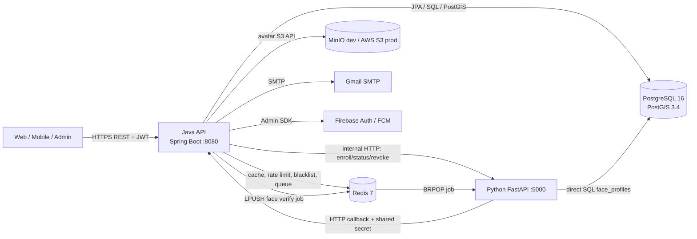
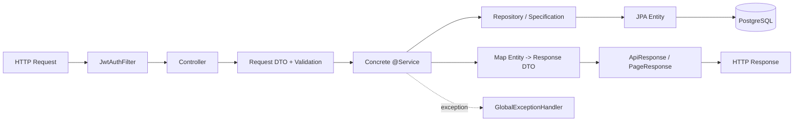
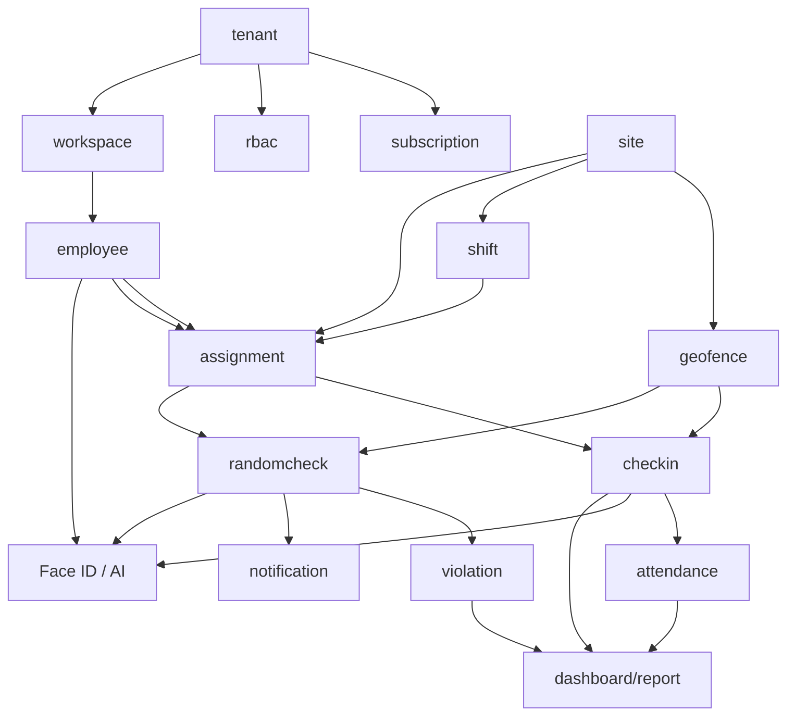
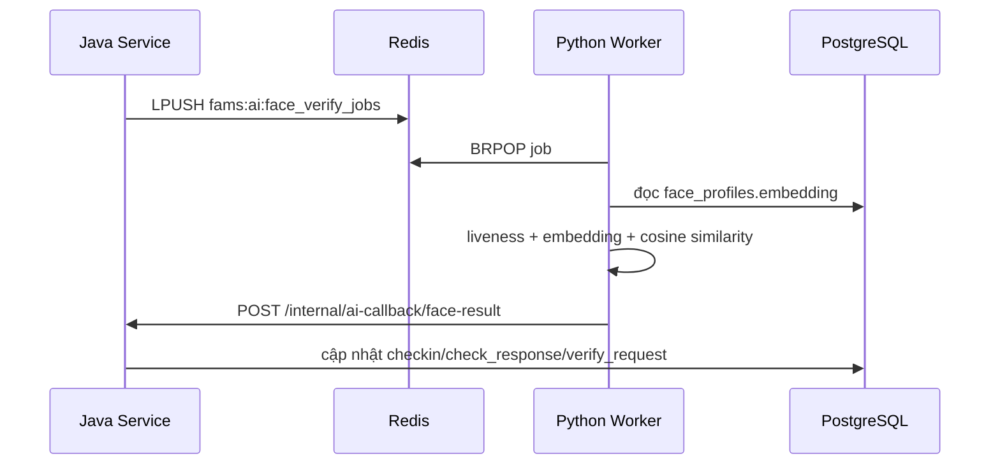

# 02. Kiến trúc dự án FAMS Backend

> Tài liệu mô tả kiến trúc **đang tồn tại trong code**, không phải kiến trúc mong muốn. Những điểm cần cải thiện được tách riêng ở cuối để tránh nhầm giữa “as-is” và “to-be”.

## 1. Kết luận kiến trúc

FAMS Backend hiện là:

- Một **modular monolith** Java/Spring Boot: một process, một file JAR, một database schema, nhưng package được chia theo 20 module nghiệp vụ.
- Một **companion AI service** Python/FastAPI tách process để xử lý Face ID/liveness.
- Kiến trúc code Java là **package-by-feature kết hợp layered architecture**: mỗi feature có controller → DTO → service → repository/entity.
- Tích hợp đồng bộ qua HTTP và bất đồng bộ qua Redis list.
- Dữ liệu chính nằm trong PostgreSQL/PostGIS; Redis giữ cache permission, token/rate-limit và hàng đợi.
- Hệ thống là multi-tenant theo cột `tenant_id`, không dùng database/schema riêng cho từng tenant.

Tên gọi phù hợp nhất: **Modular Monolith + AI Microservice, layered by feature**.

## 2. Sơ đồ container/runtime



Các container cùng nằm trên Docker network `fams-net`. `fams-ai` không publish port ra host trong full compose; Java gọi qua `http://fams-ai:5000`.

## 3. Kiến trúc bên trong Java API

### 3.1 Luồng request chuẩn



Vai trò từng tầng:

| Tầng | Trách nhiệm hiện tại | Không nên chứa |
|---|---|---|
| Controller | Route, path/query/body, `@Valid`, `@PreAuthorize`, lấy `FamsUserDetails`, chọn HTTP status, bọc `ApiResponse` | Query DB và thuật toán nghiệp vụ |
| Request DTO | Hợp đồng input, kiểu dữ liệu, Bean Validation, Swagger schema | JPA annotation và xử lý DB |
| Service | Nghiệp vụ, transaction, authorization bổ sung, phối hợp nhiều repository/module, mapper entity–response | Chi tiết HTTP |
| Repository | CRUD, derived query, JPQL/native PostGIS, `JpaSpecificationExecutor` | Quyết định nghiệp vụ phức tạp |
| Entity | Ánh xạ bảng/cột, lifecycle timestamp/default | Trả trực tiếp ra API |
| Response DTO | Hợp đồng output, che field nhạy cảm, kết hợp tên/dữ liệu hiển thị | Hành vi ghi dữ liệu |
| Shared | Security, exception, response wrapper, monitoring, client tích hợp | Nghiệp vụ riêng một module |

### 3.2 Service và “ImplService” trong code hiện tại

Code **không có** cấu trúc `XService` interface + `XServiceImpl`. Ví dụ:

```java
@Service
public class CheckinService { ... }
```

`CheckinService`, `EmployeeService`, `TenantService`, `AttendanceSummaryService`… vừa là service contract nội bộ vừa là implementation. Ngoại lệ đáng chú ý là `UserDetailsServiceImpl implements UserDetailsService`, vì đây là interface của Spring Security.

Vì vậy chuỗi thực tế là:

```text
Entity/Model ↔ Repository ↔ concrete Service ↔ Controller
                  ↑              ↕
             Specification     DTO request/response
```

Nếu chuẩn hóa thành interface/implementation, có thể đổi thành:

```text
service/CheckinService.java             # interface
service/impl/CheckinServiceImpl.java    # @Service implementation
```

Không nên đổi hàng loạt chỉ để đúng tên mẫu. Interface có giá trị khi có nhiều implementation, cần tách public contract, hoặc cần adapter/test double rõ ràng; nếu không, concrete service hiện tại đơn giản hơn.

### 3.3 Package-by-feature

Các module có thể chia thành nhóm:

| Nhóm | Module |
|---|---|
| Identity & access | `auth`, `rbac`, `audit` |
| Tổ chức | `tenant`, `subscription`, `workspace`, `employee` |
| Nơi và lịch làm | `site`, `geofence`, `shift`, `assignment` |
| Chấm công | `checkin`, `attendance`, `violation` |
| Giám sát hiện diện | `randomcheck`, `notification` |
| Tổng hợp/đọc | `dashboard`, `report`, `search`, `platform` |

Module là ranh giới package, chưa phải ranh giới deploy hay ranh giới dữ liệu. Service một module thường inject thẳng repository/service của module khác.

## 4. Quan hệ phụ thuộc nghiệp vụ



Quan hệ dữ liệu chính:

```text
User --< UserRole >-- Role --< Permission
  |
  └── Employee >-- Tenant
         ├── WorkspaceMember >-- Workspace
         └── Assignment >-- Site >-- Geofence
                    └── Shift
                    ├── CheckinRecord --(aggregate)--> AttendanceSummary
                    └── ScheduledCheck --< CheckResponse --< Violation
```

Phần lớn entity lưu foreign key dưới dạng `UUID` (`employeeId`, `siteId`...) thay vì khai báo `@ManyToOne`. Ưu điểm là tránh lazy-loading ngoài ý muốn; đổi lại tính liên kết và tính hợp lệ phải được service/repository tự kiểm soát.

## 5. Persistence và migration

- Spring Data JPA/Hibernate làm ORM.
- `spring.jpa.hibernate.ddl-auto=validate`: Hibernate chỉ kiểm tra schema, không tự tạo/sửa bảng.
- Flyway chạy `classpath:db/migration` khi app khởi động.
- PostgreSQL extension PostGIS cung cấp kiểm tra geofence bằng native query `ST_Within`, `ST_Buffer`, `ST_MakePoint`.
- `Specification` được dùng cho filter/list động và pagination.
- Soft delete phổ biến qua `deleted_at`; repository phải luôn chọn `DeletedAtIsNull` hoặc specification tương đương.
- UUID là khóa chính chính của các entity nghiệp vụ.
- Time lưu bằng `OffsetDateTime`; ngày công tính lại theo timezone của site.

Nguồn schema chính thức là `api-server/src/main/resources/db/migration`. ERD DBML và `database/migrations` có thể chậm hơn code.

## 6. Multi-tenancy

Thiết kế hiện tại là shared database/shared schema:

- Bảng nghiệp vụ chứa `tenant_id`.
- JWT access token chứa `tenantId` và `role` đang active.
- Người dùng có thể có nhiều `UserRole` ở nhiều tenant.
- `/auth/switch-tenant` cấp cặp token mới và lưu `activeTenantId` vào refresh token.
- Permission thực tế được `JwtAuthFilter` đọc từ DB và cache Redis 5 phút theo `userId:tenantId`.
- Platform admin nhận toàn bộ permission; platform staff có permission platform-scoped được merge vào permission tenant.
- Tenant suspend được chặn qua Redis key trong filter và kiểm tra thêm ở một số luồng login/service.

Điểm cần nhớ khi phát triển: mọi query đọc/ghi nghiệp vụ phải scope bằng `tenantId`; `findById(id)` đơn thuần thường không đủ an toàn.

## 7. Security architecture

### 7.1 Authentication

- Spring Security ở chế độ stateless, CSRF tắt.
- `JwtAuthFilter` đọc Bearer token, kiểm tra blacklist/logout-all timestamp, parse claims và dựng `FamsUserDetails`.
- Access token là JWT HMAC, TTL mặc định 15 phút.
- Refresh token là chuỗi ngẫu nhiên 64 byte; DB chỉ lưu SHA-256 hash, TTL mặc định 30 ngày.
- Password hash bằng BCrypt.
- TOTP secret mã hóa AES-GCM; backup code hash BCrypt.
- Login Google/Firebase Phone xác thực token qua provider tương ứng.

### 7.2 Authorization

- Route public được khai trong `SecurityConfig`.
- Các route còn lại cần authenticated.
- Permission chi tiết dùng `@PreAuthorize("hasAuthority('resource:action')")`.
- Một số service kiểm tra lại permission từ `UserRoleRepository` và xử lý platform admin riêng.

### 7.3 Error contract

Success phổ biến:

```json
{"success": true, "message": "Success", "data": {}}
```

Error nghiệp vụ đi qua `GlobalExceptionHandler`:

```json
{
  "success": false,
  "message": "Technical message",
  "data": null,
  "errorCode": "STABLE_ERROR_CODE",
  "userMessage": "Thông báo thân thiện bằng tiếng Việt"
}
```

## 8. Giao tiếp Java–AI

Có hai kiểu:

### 8.1 HTTP đồng bộ

Java `AiServiceClient` gọi FastAPI để enroll, revoke và xem status. Header `X-Internal-Secret` bảo vệ endpoint AI.

### 8.2 Redis queue bất đồng bộ



AI service cũng ghi trực tiếp `face_profiles` khi enroll/revoke. Điều này tạo coupling mạnh vào schema Java/Flyway.

## 9. Xử lý nền và lịch

`ApiServerApplication` bật cả `@EnableScheduling` và `@EnableAsync`.

| Job | Lịch mặc định | Mục đích |
|---|---|---|
| `SubscriptionExpirationJob` | 00:00 hằng ngày | Chuyển subscription hết hạn |
| `RandomCheckSchedulerJob` | 00:01 hằng ngày | Sinh scheduled check theo assignment/config |
| `RandomCheckDispatchJob` | mỗi 60 giây | Lấy check đến hạn từ Redis và gửi notification |
| `NoResponseViolationJob` | mỗi 120 giây | Đóng check hết hạn, tạo `no_response` violation |
| `AttendanceSummaryJob` | 01:00 UTC hằng ngày | Recompute ngày trước làm catch-up |
| `DataRetentionJob` | 03:00 mỗi Chủ nhật | Xóa dữ liệu notification/delivery quá hạn |

Email gửi bằng các method `@Async`. Trạng thái một số job được ghi qua `ScheduledJobMonitor` để phục vụ health/status.

## 10. Deployment architecture

| Biến thể | Compose | Thành phần |
|---|---|---|
| Java only | `docker-compose.yml` | API, PostgreSQL/PostGIS, Redis |
| Dev | `docker-compose.yml` + `docker-compose.dev.yml` | Java only + source mount + MinIO + auto-seed |
| Full | `docker-compose.full.yml` | API, AI, PostgreSQL/PostGIS, Redis |
| Full dev | full + dev override | Thêm source mount/hot reload, MinIO và auto-seed |

Production Java image build hai stage: Maven/JDK 21 tạo JAR, sau đó chạy trên Temurin JRE 21. AI image dùng Python 3.11 slim và bake sẵn PyTorch, TensorFlow, DeepFace/dlib model.

## 11. Điểm mạnh hiện tại

- Package theo feature giúp định vị code nhanh hơn layered package toàn cục.
- Hợp đồng request/response tách khỏi entity.
- Flyway + `ddl-auto=validate` giảm schema drift ngẫu nhiên.
- Có tenant scoping trong phần lớn repository/service và JWT hỗ trợ active tenant.
- Có integration test rộng trên hầu hết feature.
- Luồng AI nặng được tách process và verify async để không khóa request check-in.
- Có response/error wrapper, Swagger, actuator và health indicator.

## 12. Rủi ro và lệch kiến trúc cần ưu tiên

Đây là các quan sát kỹ thuật từ code, cần xác nhận nghiệp vụ trước khi sửa:

1. **Ranh giới module chưa được cưỡng chế.** Service inject trực tiếp repository của nhiều module; thay đổi bảng/logic dễ lan rộng.
2. **Tenant isolation dựa nhiều vào kỷ luật lập trình.** Chưa có global Hibernate tenant filter hoặc filter bắt buộc đối chiếu `{tenantId}` trên URL với claim active tenant. Mỗi endpoint/service phải tự kiểm tra; thiếu một điều kiện có thể tạo lỗ hổng truy cập chéo tenant.
3. **Authorization bị lặp ở hai nơi.** Có endpoint chỉ dựa `@PreAuthorize`, có service lại query permission lần nữa. Điều này dễ tạo hành vi không đồng nhất và query thừa.
4. **AI dùng chung database schema.** Python ghi trực tiếp `face_profiles`, nên thay migration Java có thể làm AI hỏng mà compiler không phát hiện.
5. **Queue Face ID chưa có durable job contract.** Redis list không thấy retry policy, dead-letter queue hay idempotency rõ ràng; callback lỗi chỉ log, kết quả có thể treo `null`.
6. **Một số side effect “best effort” nằm trong transaction chính.** Ví dụ `CheckinService` bắt exception khi gọi `AttendanceSummaryService`, nhưng method phía dưới vẫn tham gia transaction; runtime exception có thể đánh dấu transaction rollback-only. Cần test failure-path hoặc tách transaction/event rõ ràng.
7. **Entity association là UUID thủ công.** Nhẹ và rõ query nhưng compiler/ORM không bảo vệ quan hệ; cần validation service và FK migration đầy đủ.
8. **Unit test Java rất mỏng.** Maven chỉ có context-load test; phần lớn kiểm chứng là shell integration test, chậm hơn và khó cô lập nhánh logic biên.
9. **Version hạ tầng chưa khóa hết.** MinIO dùng tag `latest`, có thể thay đổi hành vi theo thời điểm build.
10. **Tài liệu cũ có drift.** `backend-structure.txt`, `database/migrations` và một số mô tả review không luôn phản ánh nguồn chạy thực tế.

## 13. Hướng kiến trúc đề xuất theo thứ tự

Không nên viết lại toàn bộ. Có thể cải tiến dần:

1. Đặt một cơ chế duy nhất kiểm tra `path tenantId == active tenant claim`, ngoại trừ platform endpoint được khai rõ.
2. Chuẩn hóa authorization: controller annotation cho coarse guard; một authorization component dùng chung cho ownership/tenant rule.
3. Viết architecture test (ví dụ ArchUnit) để ngăn controller gọi repository trực tiếp và hạn chế dependency vòng.
4. Tách domain event cho `CheckinCompleted`, `FaceVerificationCompleted`, `ViolationCreated`; side effect có retry/outbox nếu nghiệp vụ yêu cầu chắc chắn.
5. Định nghĩa versioned payload cho Redis job/callback, thêm idempotency, retry và DLQ.
6. Thêm unit test cho thuật toán thời gian, timezone, ca qua đêm, quota và state transition; giữ shell test cho end-to-end.
7. Chỉ tạo `Service` interface ở boundary cần thay implementation/integration, không máy móc áp dụng cho mọi CRUD.
