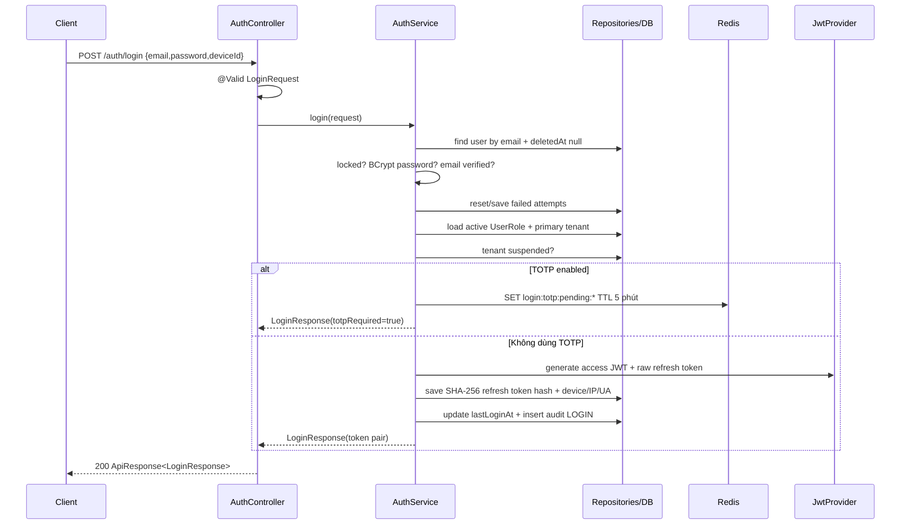
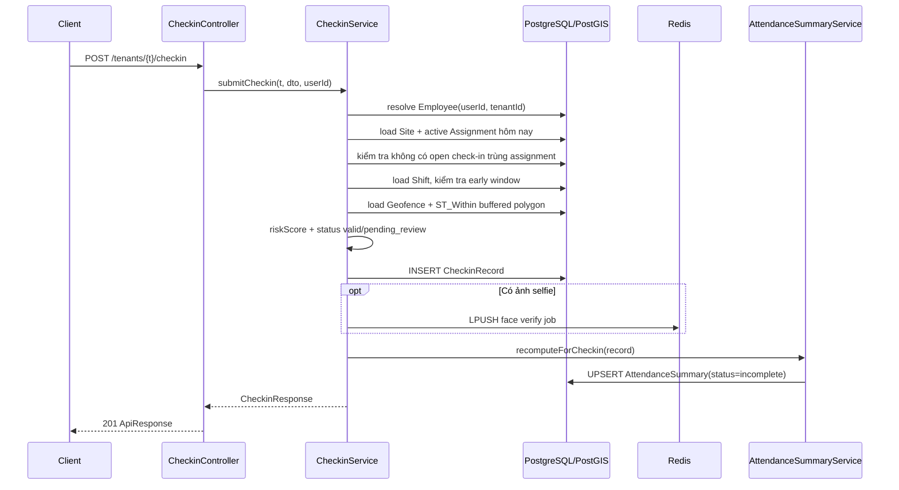
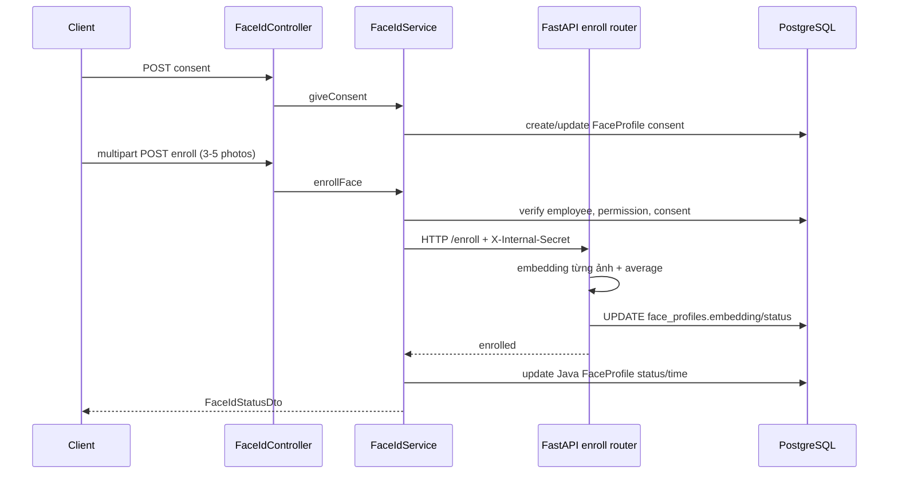
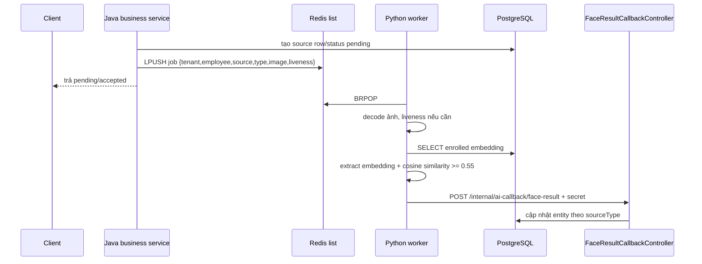

# 03. Luồng logic Model – DTO – Service – Controller

## 1. Cách đọc một tính năng trong dự án này

Trong FAMS, “model” thực tế chủ yếu là JPA `entity`. Một request thông thường đi theo hướng:

```text
HTTP JSON
  → Controller
  → Request DTO (@Valid)
  → concrete @Service (@Transactional)
  → Repository / Specification
  → JPA Entity
  → PostgreSQL
  → Service tự map Entity sang Response DTO
  → ApiResponse / PageResponse
  → HTTP JSON
```

Không có thư mục `impservice`/`impl` cho các module nghiệp vụ. Class ở `service/` là implementation trực tiếp. Dự án cũng không dùng MapStruct/ModelMapper; mapper thường là method private như `toResponse`, `toDto`, hoặc builder đặt ngay trong service/controller.

### Trách nhiệm và hướng phụ thuộc

| Thành phần | Ví dụ | Ý nghĩa |
|---|---|---|
| Entity/model | `CheckinRecord` | Trạng thái lưu trong bảng `checkins` |
| Request DTO | `SubmitCheckinRequest` | Chỉ chứa dữ liệu client được phép gửi |
| Response DTO | `CheckinResponse` | Chỉ trả dữ liệu client cần thấy |
| Repository | `CheckinRepository` | Query DB, gồm native query PostGIS |
| Service implementation | `CheckinService` | Áp dụng quy tắc nghiệp vụ và phối hợp module |
| Controller | `CheckinController` | Endpoint, authentication, permission, HTTP response |

Entity không nên được dùng làm request/response trực tiếp vì sẽ làm lộ field nội bộ, khó version API và cho phép client sửa field không được phép.

## 2. Luồng lõi A — Login email/password và cấp JWT

### 2.1 Các lớp tham gia

| Tầng | Lớp/file | Vai trò |
|---|---|---|
| Controller | `auth/controller/AuthController` | `POST /api/v1/auth/login` |
| Request DTO | `auth/dto/request/LoginRequest` | `email`, `password`, `deviceId`; validate email/password ≥ 8 ký tự |
| Service | `auth/service/AuthService.login` | Kiểm tra account, password, tenant, TOTP; cấp token |
| Entity | `User`, `RefreshToken`, `UserRole`, `Tenant`, `AuditLog` | Account, session, role active, trạng thái tenant, audit |
| Repository | `UserRepository`, `RefreshTokenRepository`, `UserRoleRepository`, `TenantRepository` | Truy vấn và lưu dữ liệu |
| Shared | `JwtProvider`, `HttpRequestUtils` | Ký JWT, sinh/hash refresh token, lấy IP/User-Agent |
| Response DTO | `LoginResponse` | Token pair hoặc `totpRequired + pendingToken` |
| Cross-service | `AuditLogService` | Ghi sự kiện `LOGIN` |

### 2.2 Trình tự



### 2.3 Quy tắc nghiệp vụ đang áp dụng

1. Email phải tồn tại và chưa soft-delete; không phân biệt “email sai” với “password sai”.
2. Nếu `lockedUntil > now`, trả account locked.
3. Mật khẩu sai tăng `failedLoginAttempts`; đạt ngưỡng trong `AppConstants` thì khóa tạm thời.
4. Tài khoản email phải `emailVerified=true`.
5. Role đầu tiên trong danh sách active được dùng làm `primaryTenantId`/`primaryRole`.
6. Tenant primary đang `suspended` chặn login của non-platform-admin.
7. Nếu TOTP bật, chưa cấp access/refresh token; Redis giữ pending context 5 phút.
8. Access JWT chứa `sub/userId`, email, deviceId, platform flag, tenantId và role.
9. Refresh token raw chỉ trả client; DB lưu SHA-256 hash.
10. Login thành công cập nhật `lastLoginAt` và audit.

### 2.4 Model ↔ DTO mapping

`LoginRequest.password` không bao giờ đi vào entity nguyên dạng; service dùng BCrypt so với `User.passwordHash`. `LoginResponse` không trả `User`, role entity hay token hash. Đây là ví dụ đúng về DTO bảo vệ model.

### 2.5 Các nhánh liên kết

- `/auth/login/totp` dùng `LoginTotpService` để đổi pending token + TOTP/backup code lấy token thật.
- `/auth/switch-tenant` kiểm tra `UserRole` ở tenant đích, rotate refresh token và cấp JWT có tenant mới.
- `/auth/refresh-token` dùng `RefreshTokenService`; active tenant đã chọn được giữ trong `RefreshToken.activeTenantId`.
- Logout ghi blacklist/timestamp ở Redis để vô hiệu access token trước khi hết TTL.

## 3. Luồng lõi B — Check-in GPS → Face verify async → Attendance summary

### 3.1 Các lớp tham gia

| Tầng | Check-in | Attendance phụ thuộc |
|---|---|---|
| Controller | `CheckinController.submitCheckin` | `AttendanceSummaryController` cho API đọc/điều chỉnh |
| Request DTO | `SubmitCheckinRequest` | Không có DTO khi service recompute nội bộ |
| Service | `CheckinService.submitCheckin` | `AttendanceSummaryService.recomputeForCheckin/recompute` |
| Entity | `CheckinRecord` | `AttendanceSummary` |
| Repository | `CheckinRepository` | `AttendanceSummaryRepository` và đọc lại `CheckinRepository` |
| Cross-module | Employee, Assignment, Site, Shift, Geofence | Shift/Site/Employee repositories |
| Async | `FaceVerifyJobPublisher` | — |
| Response DTO | `CheckinResponse` | `AttendanceSummaryResponse` |

Endpoint:

```text
POST /api/v1/tenants/{tenantId}/checkin
Permission: checkins:create
```

Request điển hình:

```json
{
  "siteId": "...",
  "latitude": 21.0285,
  "longitude": 105.8542,
  "gpsAccuracy": 15.0,
  "deviceId": "phone-01",
  "employeePhotoBase64": "...optional...",
  "requiresLiveness": false
}
```

### 3.2 Trình tự check-in



### 3.3 Quy tắc check-in

1. JWT user phải có `Employee` trong đúng tenant.
2. Site phải tồn tại, chưa xóa và thuộc tenant.
3. Employee phải có assignment active tại site trong ngày hiện tại; recurring day được tính bằng `DayOfWeekBitmask`.
4. Một assignment không được có hai check-in đang mở.
5. Nếu có shift, thời điểm hiện tại theo timezone site không được sớm hơn `shift.startTime - earlyCheckinMinutes`.
6. Nếu có geofence active, native PostGIS kiểm tra điểm GPS nằm trong polygon đã buffer theo mét.
7. Ngoài geofence → `pending_review`; trong geofence → `valid`.
8. `gpsRiskScore` tăng theo độ chính xác GPS xấu và ngoài geofence.
9. Có ảnh → publish job Face ID; request không đợi AI.
10. Sau save, daily attendance summary được recompute ngay.

### 3.4 Checkout và tính phút công

Endpoint:

```text
POST /api/v1/tenants/{tenantId}/checkin/{checkinId}/checkout
```

`CheckinService.submitCheckout` kiểm tra ownership, chưa checkout, geofence checkout và tính:

```text
effectiveStart = max(actualCheckIn, shiftStart)

effectiveEnd = min(actualCheckOut,
                   shiftEnd + lateCheckoutMinutes nếu allowOvertime,
                   shiftEnd nếu không allowOvertime)

workMinutes = max(0, minutes(effectiveStart, effectiveEnd))
```

Ca qua đêm dùng `shiftEnd` ở ngày kế tiếp. Checkout ngoài geofence có thể đẩy status từ `valid` sang `pending_review`. Sau đó attendance được recompute lần nữa.

### 3.5 Attendance summary nối với check-in như thế nào

`AttendanceSummaryService.recompute` đọc tất cả session của một employee/site/ngày local:

| Field summary | Cách tính |
|---|---|
| `firstCheckinAt` | Check-in sớm nhất |
| `lastCheckoutAt` | Checkout muộn nhất trong các session đã đóng |
| `totalWorkMinutes` | Tổng `CheckinRecord.workMinutes` |
| `sessionCount` | Số session trong ngày |
| `status` | Có session mở → `incomplete`, ngược lại `present` |
| `lateMinutes` | `firstCheckinAt - shiftStart` nếu dương |
| `earlyLeaveMinutes` | `shiftEnd - lastCheckoutAt` nếu dương và không còn session mở |
| `otMinutes` | Phần sau shift end, chỉ khi `allowOvertime`, cap bởi `lateCheckoutMinutes` |
| `missingCheckout` | Có session mở và ngày attendance đã ở quá khứ |

Upsert key logic là `(tenantId, employeeId, siteId, attendanceDate)`. Job 01:00 UTC recompute ngày trước làm cơ chế catch-up.

### 3.6 HR override

`PATCH /checkin/{id}/override` nhận `OverrideCheckinRequest`, cho HR chuyển status sang `valid` hoặc `rejected`, lưu lý do rồi recompute attendance. Đây là chỗ check-in và attendance nối hai chiều về mặt nghiệp vụ: thay quyết định check-in phải cập nhật dữ liệu tổng hợp.

## 4. Luồng lõi C — Random check → Notification → Response/Violation

### 4.1 Các model chính và state

```text
RandomCheckConfig
    ↓ snapshot vào
ScheduledCheck: pending → sent → responded
                         └──────→ no_response
                 pending/sent → cancelled
    ↓ response
CheckResponse: pass | fail
    ↓ nếu lỗi
Violation: unresolved → confirmed | dismissed
```

Các class:

- Controller: `RandomCheckConfigController`, `ScheduledCheckController`.
- Request DTO: `CreateRandomCheckConfigRequest`, `GenerateScheduledChecksRequest`, `ManualCheckRequest`, `SubmitCheckResponseRequest`.
- Response DTO: `RandomCheckConfigResponse`, `ScheduledCheckResponse`, `CheckResponseDto`, `ScheduledCheckDetailResponse`.
- Service: `ScheduledCheckGeneratorService`, `RandomCheckDispatchService`, `CheckResponseService`, `NoResponseViolationService`, `ViolationService`.
- Entity: `RandomCheckConfig`, `ScheduledCheck`, `CheckResponse`, `Violation`, `Notification`.
- Redis: `RandomCheckDispatchQueue` cho lịch dispatch; `FaceVerifyJobPublisher` khi mode yêu cầu face.

### 4.2 Giai đoạn sinh lịch

Trigger tự động: `RandomCheckSchedulerJob` lúc 00:01; trigger tay:

```text
POST /api/v1/tenants/{tenantId}/scheduled-checks/generate
Permission: randomchecks:configure
```

`ScheduledCheckGeneratorService`:

1. Lấy assignment active có shift trong ngày.
2. Idempotency: nếu assignment+date đã sinh thì bỏ qua.
3. Chọn config site override trước, nếu không có dùng tenant default.
4. Kiểm tra config active và `applicableRoles`.
5. Lấy timezone site.
6. Kiểm tra quota random check còn lại từ `PlanLimitEnforcementService`.
7. Sinh N thời điểm ngẫu nhiên trong cửa sổ cho phép, đảm bảo `minIntervalMinutes`.
8. Copy config thành JSON `configSnapshot`, để thay config sau này không đổi lịch cũ.
9. Lưu `ScheduledCheck(status=pending, scheduledAt, expiresAt)`.
10. Enqueue ID vào Redis sorted dispatch structure qua `RandomCheckDispatchQueue`.

### 4.3 Giai đoạn dispatch

`RandomCheckDispatchJob` chạy mỗi 60 giây:

1. Dequeue các ID đến hạn.
2. `RandomCheckDispatchService` chỉ xử lý check còn `pending`.
3. Đổi status thành `sent`.
4. Resolve employee → user.
5. `NotificationService.createNotification` tạo inbox notification và phân phối theo setting/device FCM.

### 4.4 Employee phản hồi

```text
POST /api/v1/tenants/{tenantId}/scheduled-checks/{checkId}/respond
Body: SubmitCheckResponseRequest
```

Controller resolve `Employee` từ authenticated user rồi gọi `CheckResponseService.submit`.

Service guard theo thứ tự:

1. Check thuộc tenant và employee hiện tại.
2. Chỉ status `sent` mới được phản hồi; `pending/cancelled/responded/no_response` bị chặn.
3. `now <= expiresAt`, nếu muộn trả HTTP 410.
4. Chưa có response trùng.
5. Parse `checkMode` từ immutable config snapshot.
6. Kiểm tra location bằng chính native PostGIS method của `CheckinRepository`.
7. Mode face/liveness mà thiếu ảnh → fail ngay.
8. Lưu `CheckResponse`, đổi scheduled check sang `responded`.
9. Location/ảnh thiếu fail → tạo `Violation` tương ứng.
10. Nếu có ảnh → publish Face ID async; kết quả callback có thể đổi outcome thành fail và tạo violation `face_fail`.

### 4.5 Không phản hồi

`NoResponseViolationJob` chạy mỗi 120 giây. Với check `sent` đã quá `expiresAt`:

- Đổi status `no_response`.
- Nếu chưa tồn tại `no_response` violation thì tạo mới.
- Idempotency dựa trên `(scheduledCheckId, violationType)` ở repository/service.

### 4.6 Violation và attendance

HR dùng `ViolationController`/`ViolationService` để xem, confirm, dismiss và đặt `affectsAttendance`. `Violation` giữ `scheduledCheckId` và tùy trường hợp `checkResponseId`, giúp truy ngược toàn bộ bằng chứng.

Hiện `affectsAttendance` là trạng thái nghiệp vụ trên violation; cần đọc kỹ `ViolationService.updateAttendanceImpact` trước khi giả định nó tự sửa `AttendanceSummary`, vì hai khái niệm “đánh dấu ảnh hưởng” và “recompute phút công” không nhất thiết đồng nghĩa.

## 5. Luồng lõi D — Face ID xuyên Java, Redis, Python và callback

Face ID được dùng ở ba nguồn:

| `sourceType` | Nguồn | Entity nhận kết quả |
|---|---|---|
| `checkin` | Check-in có selfie | `CheckinRecord` |
| `check_response` | Random check mode face/liveness | `CheckResponse` |
| `standalone_verify` | `POST /employees/{id}/face-id/verify` | `FaceVerifyRequest` |

### 5.1 Enrollment đồng bộ



Điểm nối đáng chú ý: Python ghi trực tiếp cùng bảng `face_profiles`; Java sau đó cũng cập nhật entity tương ứng.

### 5.2 Verify bất đồng bộ



Liveness threshold mặc định là 0.6; face similarity threshold mặc định 0.55, lấy từ env phía AI.

### 5.3 Standalone verify DTO chain

```text
VerifyFaceRequest(photoBase64, requiresLiveness)
  → FaceIdController.submitVerify
  → FaceIdService.submitVerify
  → FaceVerifyRequest entity(status=pending, expiresAt)
  → FaceVerifyJobPublisher
  → VerifyFaceSubmitResponse(verifyRequestId, pending), HTTP 202
  → callback updates FaceVerifyRequest
  → GET /verify/{verifyRequestId}
  → VerifyFaceResultResponse(pass/fail/pending, score, errorCode)
```

Client được hướng dẫn poll khoảng 1–2 giây và timeout 10–15 giây. Service tự chuyển pending quá `expiresAt` sang fail/TIMEOUT khi client poll.

## 6. Cross-cutting logic chạy trước/sau mọi feature

### 6.1 Trước controller

1. `SecurityConfig` xác định route public hay authenticated.
2. `JwtAuthFilter` kiểm tra blacklist/revoke/suspended tenant.
3. Filter nạp permission từ Redis hoặc DB và dựng `FamsUserDetails`.
4. Method security chạy `@PreAuthorize`.
5. Spring bind DTO và chạy Bean Validation.

### 6.2 Sau service

- Thành công được bọc `ApiResponse.success`, danh sách phân trang bọc thêm `PageResponse`.
- Exception chuẩn được `GlobalExceptionHandler` chuyển thành HTTP status + stable error code + Vietnamese user message.
- `@Transactional` commit khi method kết thúc bình thường và rollback với runtime exception.
- Audit/notification/attendance/AI có thể là side effect đồng bộ hoặc bất đồng bộ tùy luồng.

## 7. Cách truy vết khi tính năng “không ăn khớp”

Với một lỗi nghiệp vụ, không chỉ đọc controller và service của một module. Dùng checklist:

1. Endpoint nhận tenant/user/permission nào?
2. DTO có validate đúng rule nghiệp vụ hay chỉ validate hình thức?
3. Service đang dựa trên timezone server, UTC hay timezone site?
4. Entity status có state transition nào và migration có constraint tương ứng không?
5. Query có `tenantId` và `deletedAt is null` không?
6. Service có gọi module khác nhưng bắt/nuốt exception không?
7. Có job nền nào sửa lại dữ liệu sau request không?
8. Có Redis cache/queue khiến kết quả trễ hoặc stale không?
9. AI/provider bên ngoài có callback/retry không?
10. Test hiện tại kiểm tra rule hay chỉ kiểm tra HTTP 200?

Đối với attendance, tối thiểu phải đọc cùng nhau: `Assignment`, `Shift`, `Site.timezone`, `Geofence`, `CheckinRecord`, `CheckinService`, `AttendanceSummaryService`, job và test tương ứng. Đọc riêng một file rất dễ kết luận sai.
