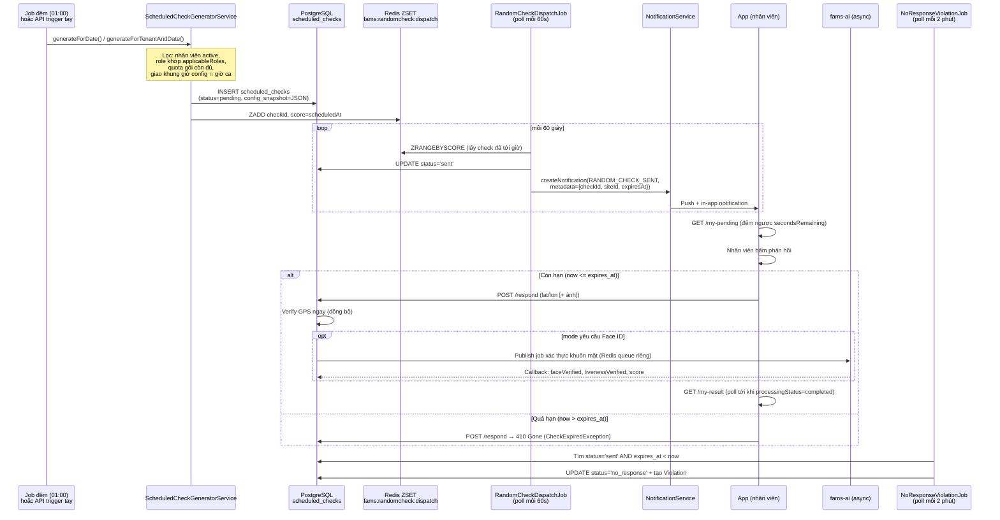

# Tài liệu thiết kế: Vòng đời 1 lượt Random Check — từ sinh check tới phản hồi

> Cập nhật theo code đang chạy ngày 01/08/2026. Tài liệu này đi theo đúng 10 user story bạn đưa ra, xác nhận trạng thái nghiệp vụ + thiết kế giao diện tương ứng cho Web/App. Đây là góc nhìn **theo trình tự thời gian** (sinh → gửi → phản hồi → hết hạn) — bổ sung cho `random-check-ui-guide.md` (góc nhìn theo màn hình/vai trò) và `random-check-config-review.md` (lịch sử audit/sửa lỗi kỹ thuật). Cả 3 tài liệu tham chiếu cùng 1 hệ thống thật, không mâu thuẫn.

## 0. Xác nhận trạng thái nghiệp vụ — cả 10/10 đã đúng

| # | User story | Trạng thái | Ai làm gì |
|---|---|---|---|
| 1 | Tự động sinh scheduled checks đầu ca | ✅ Đúng | Hệ thống (job đêm + API trigger tay) |
| 2 | Snapshot config khi sinh check | ✅ Đúng | Hệ thống |
| 3 | Tạo delayed job gửi check ("Bull/BullMQ") | ✅ Đúng — khác công nghệ (xem mục 3) | Hệ thống |
| 4 | Huỷ scheduled check khi assignment/site không còn hợp lệ | ✅ Đúng — vừa sửa 1 lỗ hổng (mục 4) | Hệ thống + HR |
| 5 | Gửi random check notification | ✅ Đúng | Hệ thống → App |
| 6 | App hiển thị random check đang chờ | ✅ Đúng | App |
| 7 | Phản hồi mode chỉ vị trí | ✅ Đúng | App |
| 8 | Phản hồi mode vị trí + Face ID | ✅ Đúng | App |
| 9 | Phản hồi mode vị trí + Face ID + Liveness | ✅ Đúng | App |
| 10 | Từ chối phản hồi trễ | ✅ Đúng | Hệ thống |

Không có tính năng nào cần Web thiết kế thêm ở nhóm 10 story này (Web chỉ liên quan gián tiếp qua màn cấu hình/theo dõi — xem `random-check-ui-guide.md`). **Cả 10 story ở đây thuộc về Hệ thống (backend, không cần UI riêng) và App (nhân viên)** — trừ mục 4 có 1 phần do HR chủ động (huỷ tay), phần còn lại tự động.

## 1. Sơ đồ tổng quan — toàn bộ vòng đời 1 lượt kiểm tra



## 2. Chi tiết từng user story

### 2.1 Tự động sinh scheduled checks đầu ca

**Ai thực hiện**: hệ thống — job đêm `RandomCheckSchedulerJob` (chạy 01:00 mỗi ngày, sinh cho mọi tenant) hoặc API trigger tay `POST /scheduled-checks/generate` (HR gọi thủ công, ví dụ khi vừa sửa config muốn áp dụng ngay cho hôm nay).

**Logic sinh check** (đã xác nhận đúng qua nhiều đợt audit):
1. Lấy mọi assignment `active`, thuộc nhân viên `active` (đã sửa — nhân viên nghỉ việc tự động bị loại), có `shift_id`, đúng ngày trong tuần (`days_of_week`).
2. Với mỗi assignment: phân giải config (site-override trước, tenant-default sau).
3. Lọc theo `applicableRoles` (nếu có) — không khớp thì bỏ qua nhân viên đó.
4. Tính khung giờ hiệu lực = **giao (∩)** giữa khung giờ config và giờ ca thực tế của nhân viên (đã sửa — không còn dùng nguyên khung config bất kể giờ ca).
5. Trừ vào hạn mức gói dịch vụ (plan) còn lại trong tháng.
6. Sinh ngẫu nhiên N thời điểm trong khung giờ hiệu lực, đảm bảo cách nhau tối thiểu `minIntervalMinutes`.
7. Idempotent — gọi lại cho cùng 1 assignment/ngày sẽ tự bỏ qua nếu đã sinh rồi.

**Web cần biết**: nút "Kích hoạt sinh lịch" (nếu Web dựng, xem `random-check-ui-guide.md` mục 3.10) chỉ nên hiển thị cho platform-admin/tenant-admin, không phải luồng chính — vận hành bình thường là tự động qua job đêm, không cần Web can thiệp.

### 2.2 Snapshot config khi sinh check

**Ai thực hiện**: hệ thống, tại thời điểm sinh check (bước trên).

**Vì sao cần**: config (số lần/khung giờ/mode/role) có thể bị HR sửa SAU khi check đã sinh — nếu không snapshot, 1 check sinh sáng sớm theo mode `location_only` có thể bị "hồi tố" áp dụng mode `location_face` nếu HR đổi config lúc trưa, gây bất ngờ cho nhân viên (chưa từng được thông báo cần chuẩn bị Face ID). `configSnapshot` (JSON) đóng băng đúng rule tại thời điểm sinh — mọi bước sau (dispatch, phản hồi, xác thực) đều đọc từ snapshot này, không đọc lại config gốc.

**App/Web cần biết**: field `configSnapshot` trả về trong mọi response liên quan tới 1 check (`GET /{checkId}`, `GET /my-pending`) — là bằng chứng "check này áp dụng đúng rule nào tại thời điểm sinh", hữu ích khi debug tranh chấp ("tại sao check này không yêu cầu ảnh mà check kia có").

### 2.3 Delayed job gửi check ("Bull/BullMQ")

**Làm rõ công nghệ quan trọng cho FE hiểu đúng kiến trúc backend** (không ảnh hưởng tới việc dựng UI, nhưng cần biết khi debug độ trễ thông báo): hệ thống này **không dùng Bull/BullMQ** — đó là thư viện Node.js, không tồn tại trong backend Java/Spring này. Cơ chế tương đương đã dùng: Redis Sorted Set (`fams:randomcheck:dispatch`, điểm số = thời gian gửi) + job quét mỗi **60 giây** lấy các check đã tới giờ và gửi thông báo.

**Ý nghĩa thực tế cho App**: độ trễ tối đa giữa "thời điểm dự kiến" (`scheduledAt`) và lúc App thực sự nhận thông báo là **~60 giây** — App/Web không nên coi `scheduledAt` là thời điểm chính xác tuyệt đối khi hiển thị, nên ưu tiên hiển thị theo trạng thái thực nhận (`status='sent'`) hơn là theo `scheduledAt` dự kiến.

**Đã xác nhận + vừa sửa (01/08/2026)**: hàng đợi này giờ có cơ chế tự phục hồi khi backend khởi động lại (đọc lại từ DB, nạp lại hàng đợi) — trước đây có rủi ro (dù hiếm) 1 check bị "rơi" khỏi hàng đợi và không bao giờ được gửi thông báo. Không cần FE làm gì, chỉ là cải thiện độ tin cậy nội bộ.

### 2.4 Huỷ scheduled check khi assignment/site không còn hợp lệ

**3 kịch bản, cả 3 đã xử lý đúng:**

| Kịch bản | Ai kích hoạt | Tự động hay cần HR bấm |
|---|---|---|
| HR chủ động huỷ 1 assignment | HR | HR bấm huỷ assignment → hệ thống tự huỷ mọi check `pending`/`sent` liên quan |
| Nhân viên bị cho nghỉ việc (`terminated`) | HR | HR đổi trạng thái nhân viên → hệ thống **tự động** huỷ mọi check `pending`/`sent` (mới sửa 01/08/2026 — trước đây bị bỏ sót) |
| Site bị xoá | HR | Không có khoảng hở — site chỉ xoá được khi hết assignment active, mà lúc đó check đã được dọn từ bước huỷ assignment rồi |

**Web cần biết**: không cần dựng UI riêng cho việc "huỷ check khi nghỉ việc" — đây là tác dụng phụ tự động của màn "Đổi trạng thái nhân viên" đã có sẵn (xem tài liệu quản lý nhân viên). Nếu muốn, có thể thêm dòng ghi chú nhỏ trong modal xác nhận "terminated": *"Mọi lượt kiểm tra ngẫu nhiên đang chờ của nhân viên này sẽ tự động bị huỷ."*

HR cũng có thể huỷ tay 1 check đơn lẻ bất kỳ lúc nào qua `POST /scheduled-checks/{checkId}/cancel` (xem `random-check-ui-guide.md` mục 3.10) — không phụ thuộc vào 3 kịch bản tự động trên.

### 2.5 Gửi random check notification

**Ai thực hiện**: hệ thống, ngay khi dispatch job (mục 2.3) xác định 1 check đã tới giờ gửi.

**Nội dung thông báo**:
```json
{
  "eventType": "RANDOM_CHECK_SENT",
  "title": "Kiểm tra ngẫu nhiên",
  "body": "Bạn có một yêu cầu kiểm tra ngẫu nhiên. Vui lòng phản hồi trong vòng 300 giây.",
  "metadata": { "checkId": "uuid", "siteId": "uuid", "expiresAt": "2026-08-01T09:05:00Z" }
}
```
`metadata` (đã bổ sung ở đợt trước) cho phép App deep-link thẳng vào đúng check, không cần mở danh sách chung.

**[MỚI, 01/08/2026]** `eventType`/`checkId`/`siteId`/`expiresAt` giờ cũng được gửi kèm trong chính **gói push FCM** (`Message.data`), không chỉ trong bản ghi `notifications` đọc qua `GET /notifications` như trước — App deep-link được ngay cả khi đang tắt hoàn toàn, không cần chờ mở app để đồng bộ danh sách. Việc gửi push này cũng không còn phụ thuộc vào cài đặt in-app của nhân viên — trước đây tắt "hiện trong inbox" (in-app) vô tình làm mất luôn push do lỗi return sớm trong code, đã sửa; 2 cờ `inAppEnabled`/`pushEnabled` giờ xét độc lập hoàn toàn. Xem `random-check-config-review.md` mục 13.2/13.3.

**App cần làm**: đăng ký lắng nghe `RANDOM_CHECK_SENT` (in-app + push), khi nhận được → hiện banner/badge nổi bật ngay lập tức (giống cuộc gọi đến, không phải thông báo thường có thể bỏ qua lâu — thời gian phản hồi thường chỉ vài phút).

### 2.6 App hiển thị random check đang chờ

`GET /scheduled-checks/my-pending` — trả danh sách check `pending`/`sent` của chính nhân viên đăng nhập (tự động theo JWT, không cần truyền `employeeId`), kèm `secondsRemaining` (đếm ngược, âm nếu đã hết hạn).

**[MỚI, 01/08/2026]** Check `pending` (chưa dispatch) chỉ trả về khi còn ≤ 60 giây nữa mới tới `scheduledAt` — cố ý, để nhân viên không thể đọc trước lịch kiểm tra ngẫu nhiên còn lại trong ngày qua network traffic. Check `sent` không bị giới hạn này. Xem `random-check-config-review.md` mục 13.1.

**UI đề xuất** (đã có trong `random-check-ui-guide.md` mục 4.1, nhắc lại ở đây cho đủ ngữ cảnh câu chuyện): banner toàn màn hình hoặc bottom-sheet khi có check `sent` — đếm ngược trực quan, không cho phép "đóng" hoặc "để sau" quá dễ dàng (khác notification thường), vì mục đích của random check là kiểm tra ĐÚNG THỜI ĐIỂM đó, không phải bất kỳ lúc nào tiện.

### 2.7-2.9 Ba mode phản hồi

Cùng 1 endpoint `POST /scheduled-checks/{checkId}/respond`, khác nhau ở dữ liệu gửi kèm — mode nào đang áp dụng đọc từ `configSnapshot.checkMode` của chính check đó (không phải App tự chọn):

| Mode | App cần thu thập | Điều kiện PASS | Xử lý đồng bộ/bất đồng bộ |
|---|---|---|---|
| `location_only` (2.7) | GPS (`latitude`, `longitude`, `accuracyMeters`) | Vị trí trong geofence site | Hoàn toàn đồng bộ — có kết quả ngay trong response |
| `location_face` (2.8) | GPS + `employeePhotoBase64` (chụp trực tiếp camera trước, không chọn ảnh thư viện) | Vị trí đúng + khuôn mặt khớp hồ sơ Face ID đã `enrolled` | GPS đồng bộ; face **bất đồng bộ** (AI xử lý ~vài giây) — App phải poll `GET /{checkId}/my-result` |
| `location_face_liveness` (2.9) | GPS + `employeePhotoBase64` | Vị trí đúng + khuôn mặt khớp + AI xác nhận người thật (chống ảnh/video giả) | GPS đồng bộ; face + liveness **bất đồng bộ**, cùng 1 lần poll |

**Điều kiện tiên quyết bắt buộc cho mode 2.8/2.9**: nhân viên phải đã đăng ký Face ID thành công (`status='enrolled'`) từ trước (tính năng Face ID enrollment, module riêng) — nếu chưa, check sẽ **luôn fail ngay lập tức** bất kể gửi ảnh gì. App nên chủ động kiểm tra trạng thái Face ID và cảnh báo trước khi để nhân viên cố gắng phản hồi vô ích (xem `random-check-ui-guide.md` mục 4.3).

**Field gửi đúng — lỗi thường gặp cần tránh**: dùng `employeePhotoBase64` (base64 ảnh thật) — **không phải** `faceImageUrl` (field khác, chỉ lưu metadata URL, không kích hoạt xác thực) và **không phải** tự tính/gửi `livenessScore` (server/AI luôn tự quyết định, client gửi lên không được tin dùng).

**Sau khi phản hồi mode 2.8/2.9**: `respond()` trả `faceVerified: null` ngay lập tức (đang chờ xử lý) — App phải chuyển sang trạng thái "Đang xác minh..." và poll `GET /{checkId}/my-result` mỗi 3-5 giây, tối đa 60 giây, cho tới khi `processingStatus="completed"`.

**HR xem lại bằng chứng**: nếu cần tranh chấp/review, HR có thể xem lại ảnh selfie đã gửi qua `GET /scheduled-checks/{checkId}/photo` (chỉ khi `hasPhotoEvidence=true`) — thuộc màn Web, xem `random-check-ui-guide.md` mục 3.8.

### 2.10 Từ chối phản hồi trễ

**Ai thực hiện**: hệ thống — kiểm tra `now > expiresAt` ngay khi nhận request `respond()`, trước khi xử lý bất kỳ logic xác thực nào.

```json
// HTTP 410 Gone
{
  "success": false,
  "errorCode": "CHECK_EXPIRED",
  "message": "Response window has expired. Check expired at 2026-08-01T09:05:00Z",
  "userMessage": "Yêu cầu kiểm tra đã hết hạn. Vui lòng liên hệ quản lý để được hỗ trợ."
}
```

**App cần làm**: chủ động vô hiệu hoá nút "Gửi phản hồi" ngay khi đồng hồ đếm ngược cục bộ về 0 — **không đợi server trả lỗi mới khoá nút** (UX kém, và tốn 1 request chắc chắn thất bại). Vẫn phải xử lý đúng mã `410`/`CHECK_EXPIRED` phòng trường hợp đồng hồ App lệch với server (ví dụ App vừa mở lại sau khi ở background lâu, đồng hồ local không kịp cập nhật).

Khi hết hạn không phản hồi → check tự động chuyển `no_response` (qua job nền, tối đa 2 phút sau khi hết hạn) → tạo `Violation` loại `no_response` — nhân viên không nhận thêm cảnh báo riêng cho việc này qua notification (chỉ phản ánh gián tiếp qua báo cáo vi phạm/bảng công, xem `attendance-ui-permissions-guide.md`).

## 3. Business rules xuyên suốt — FE cần biết để giải thích đúng hành vi hệ thống

1. **Không có "làm lại"** — 1 check chỉ nhận đúng 1 lần phản hồi (`UNIQUE` constraint DB). Nếu App bị lỗi mạng giữa chừng và không chắc request đã tới server, gọi lại `GET /{checkId}/my-result` (hoặc `/my-pending`) để kiểm tra trạng thái trước khi thử gửi lại — tránh vòng lặp "gửi lại nhiều lần" gây lỗi 400 khó hiểu.
2. **`configSnapshot` là nguồn sự thật cho 1 check cụ thể**, không phải config hiện tại của site/tenant — 2 field này có thể khác nhau nếu HR vừa sửa config sau khi check đã sinh (xem mục 2.2).
3. **Độ trễ gửi thông báo tối đa ~60 giây** so với `scheduledAt` — bình thường, không phải lỗi (xem mục 2.3).
4. **Giờ kiểm tra luôn nằm trong giờ ca thực tế** của nhân viên hôm đó (giao giữa config và ca) — trừ ca qua đêm (`allowOvernight`), hiện vẫn dùng nguyên khung config, giới hạn đã biết (P2, xem `random-check-config-review.md` mục 13).
5. **Kiểm tra thủ công (HR chỉ định đích danh)** đi qua cùng hệ thống dispatch/phản hồi này — không phải luồng riêng, App xử lý y hệt (xem `random-check-ui-guide.md` mục 3.9 phía Web).

## 4. Mã lỗi cần App xử lý (riêng luồng phản hồi)

| HTTP | errorCode | Khi nào | App nên làm gì |
|---|---|---|---|
| 400 | `VALIDATION_ERROR` | Thiếu `latitude`/`longitude` | Validate trước khi gửi |
| 400 | — | Check đang `pending` (chưa `sent`), đã `responded`, hoặc đã `cancelled` | Chỉ hiện nút phản hồi khi `status='sent'` |
| 404 | `RESOURCE_NOT_FOUND` | Check không tồn tại hoặc không thuộc nhân viên gọi | Refresh lại `/my-pending` |
| 410 | `CHECK_EXPIRED` | Phản hồi sau `expiresAt` | Khoá nút trước khi hết hạn (mục 2.10), fallback xử lý mã lỗi này |

## 5. Checklist bàn giao (bổ sung cho checklist đã có ở `random-check-ui-guide.md`)

- [ ] **App**: xác nhận đồng hồ đếm ngược dựa trên `secondsRemaining` từ server (không phải tính lại từ `scheduledAt` theo giờ local máy) — tránh lệch giờ thiết bị.
- [ ] **App**: khoá nút phản hồi ngay khi đếm ngược về 0, không đợi lỗi `410` từ server mới khoá (mục 2.10).
- [ ] **App**: hiện rõ trạng thái "Đang xác minh..." (không phải "Thất bại") khi `faceVerified=null` sau khi gửi ảnh — poll `my-result`, không tự suy diễn (mục 2.8/2.9).
- [ ] **App**: kiểm tra trạng thái Face ID `enrolled` trước khi cho phép thao tác trên check yêu cầu mode face (mục 2.7-2.9).
- [ ] **Web**: thêm ghi chú nhỏ trong modal "Đổi trạng thái nhân viên → Nghỉ việc" về việc tự động huỷ check đang chờ (mục 2.4, không bắt buộc, chỉ là UX rõ ràng hơn).
