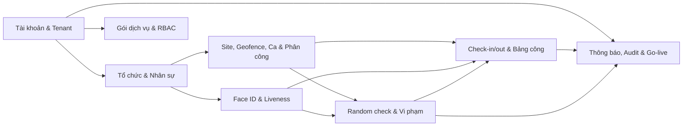
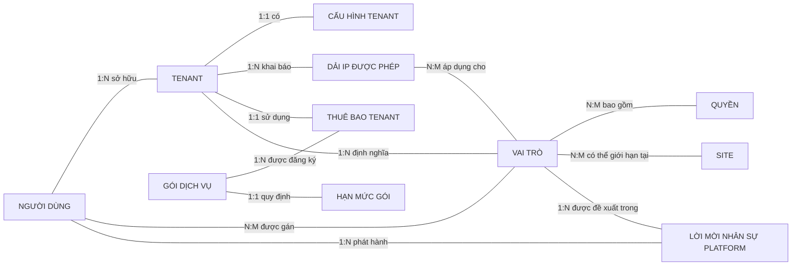
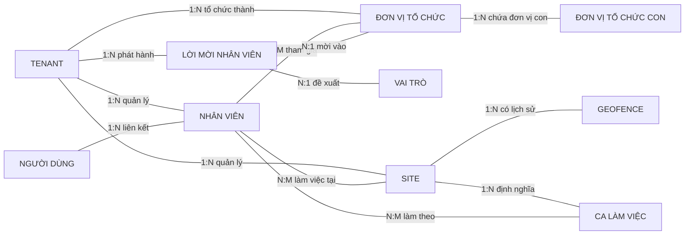
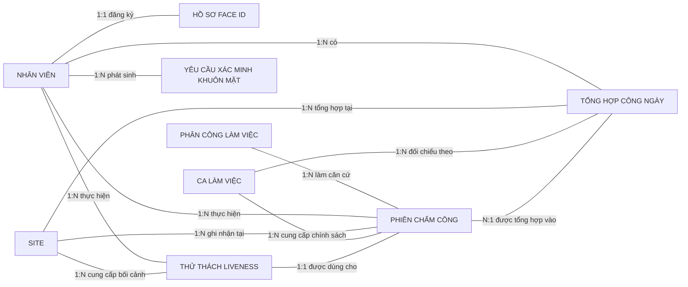
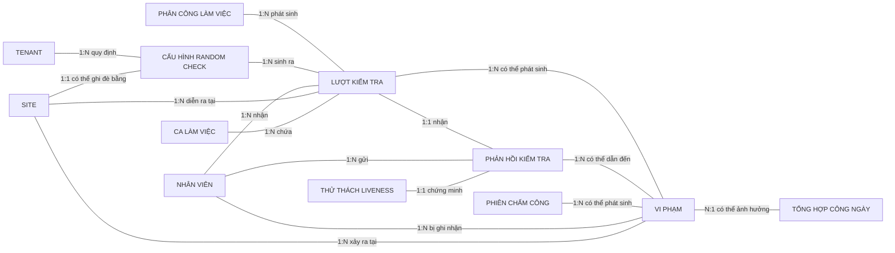
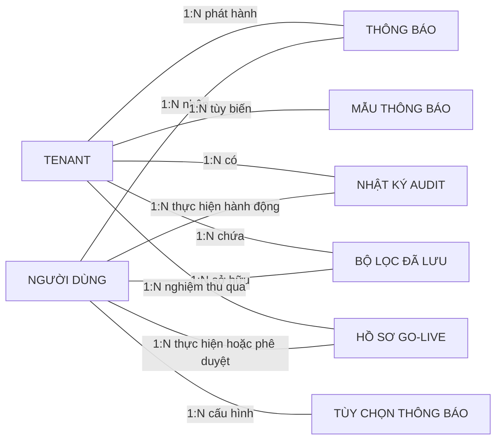

# Mô hình ERD mức phân tích của hệ thống FAMS

**Loại tài liệu:** Conceptual ERD / Business ERD

**Phạm vi:** Toàn bộ nền tảng FAMS

**Trạng thái mô tả:** As-is theo mã nguồn và use case tại ngày 2026-08-18

## 1. Mục đích và phạm vi

Tài liệu mô hình hóa các đối tượng nghiệp vụ chính của FAMS và quan hệ giữa chúng trước khi xét đến cách cài đặt cơ sở dữ liệu. Mô hình được dùng để:

- thống nhất thuật ngữ giữa nghiệp vụ, phát triển và kiểm thử;
- xác định đối tượng mà hệ thống cần quản lý;
- làm rõ đối tượng nào sở hữu hoặc phát sinh đối tượng nào;
- thể hiện bội số cơ bản của các quan hệ;
- làm đầu vào cho ERD logic và thiết kế cơ sở dữ liệu vật lý.

ERD này không mô tả kiểu dữ liệu, khóa ngoại, index, tên cột, cascade, soft delete hoặc chi tiết lưu trữ. Các thuộc tính dạng “mã …” là thuộc tính định danh nghiệp vụ của thực thể, không nhất thiết trùng với mã kỹ thuật trong database.

## 2. Quy ước đọc

| Ký hiệu | Ý nghĩa | Ví dụ cách đọc |
|---|---|---|
| `1:1` | Một – một | Một tenant có một cấu hình tenant |
| `1:N` | Một – nhiều | Một tenant quản lý nhiều nhân viên |
| `N:1` | Nhiều – một | Nhiều nhân viên cùng thuộc một tenant |
| `N:M` | Nhiều – nhiều | Nhiều nhân viên làm việc tại nhiều site |
| `PK` | Thuộc tính định danh của thực thể | Mã nhân viên (PK) |

Để sơ đồ dễ đọc với cả người không chuyên về cơ sở dữ liệu, tài liệu chỉ ghi bội số đơn giản `1:1`, `1:N`, `N:1`, `N:M`; không dùng ký hiệu tùy chọn như `0..1`, `0..N` hoặc ký pháp chân quạ.

Quan hệ N:M được vẽ trực tiếp giữa hai thực thể nghiệp vụ. Không đưa bảng nối kỹ thuật lên sơ đồ. Khi hệ thống quản lý chính quan hệ đó như một đối tượng có vòng đời và thuộc tính riêng, tài liệu vẫn mô tả đối tượng nghiệp vụ tương ứng trong danh mục thực thể. Ví dụ, sơ đồ tổng quát vẽ **Nhân viên N:M Site**, còn mục **Phân công làm việc** giải thích ngày hiệu lực, ca, vai trò và trạng thái của quan hệ này.

## 3. Bức tranh tổng thể

FAMS là nền tảng đa tenant. Một tài khoản người dùng có thể tham gia nhiều tenant, nhưng hồ sơ nhân viên, dữ liệu chấm công, địa điểm và quy tắc vận hành luôn thuộc phạm vi một tenant. Các miền nghiệp vụ chính liên kết như sau:

## 4. Danh mục thực thể nghiệp vụ

### 4.1. Tài khoản và tenant

#### Người dùng

Đại diện cho một cá nhân có tài khoản đăng nhập FAMS. Một người dùng có thể là người dùng cấp platform, chủ tenant hoặc được liên kết với hồ sơ nhân viên tại nhiều tenant khác nhau.

Thuộc tính:

- **Mã người dùng (PK)**
- Email
- Số điện thoại
- Tên hiển thị
- Ảnh đại diện
- Ngày sinh
- Giới tính
- Quê quán
- Địa chỉ
- Trạng thái hoạt động
- Trạng thái xác minh email
- Trạng thái xác minh số điện thoại
- Trạng thái xác thực hai lớp
- Trạng thái tài khoản platform
- Thời điểm đăng nhập gần nhất

#### Tenant / Doanh nghiệp

Đại diện cho một tổ chức khách hàng độc lập sử dụng FAMS. Tenant là ranh giới sở hữu và cô lập dữ liệu nghiệp vụ.

Thuộc tính:

- **Mã tenant (PK)**
- Tên tenant
- Tên định danh ngắn (slug)
- Tên miền
- Logo
- Ngành nghề
- Quốc gia
- Múi giờ
- Ngôn ngữ
- Đơn vị tiền tệ
- Trạng thái

#### Cấu hình tenant

Lưu các quy ước hiển thị và nhận diện thương hiệu áp dụng riêng cho một tenant.

Thuộc tính:

- **Mã cấu hình tenant (PK)**
- Định dạng ngày
- Định dạng giờ
- Màu thương hiệu chính
- Màu thương hiệu phụ
- Màu nhấn
- Tiền tố mã nhân viên
- Độ dài phần số của mã nhân viên

#### Dải IP được phép

Đại diện cho một địa chỉ hoặc dải IP được tenant cho phép truy cập, có thể giới hạn theo vai trò.

Thuộc tính:

- **Mã cấu hình IP (PK)**
- Địa chỉ/dải IP
- Nhãn mô tả
- Trạng thái hoạt động

### 4.2. Gói dịch vụ và phân quyền

#### Gói dịch vụ

Mô tả một sản phẩm thuê bao mà platform cung cấp cho tenant.

Thuộc tính:

- **Mã gói (PK)**
- Tên nội bộ
- Tên hiển thị
- Mô tả
- Giá theo tháng
- Giá theo năm
- Thứ tự hiển thị
- Trạng thái hoạt động

#### Hạn mức gói

Mô tả năng lực tối đa mà một gói cho phép.

Thuộc tính:

- **Mã bộ hạn mức (PK)**
- Số nhân viên tối đa
- Số site tối đa
- Dung lượng lưu trữ tối đa
- Số random check tối đa mỗi tháng

#### Thuê bao tenant

Là việc một tenant sử dụng một gói trong một khoảng thời gian và chu kỳ thanh toán xác định.

Thuộc tính:

- **Mã thuê bao (PK)**
- Trạng thái thuê bao
- Chu kỳ thanh toán
- Thời điểm bắt đầu
- Thời điểm hết hạn
- Thời điểm hủy

#### Vai trò

Là tập hợp trách nhiệm và quyền được gán cho người dùng. Vai trò có thể là vai trò hệ thống/platform hoặc vai trò tùy chỉnh của tenant.

Thuộc tính:

- **Mã vai trò (PK)**
- Tên vai trò
- Mô tả
- Là vai trò hệ thống
- Là vai trò cấp platform

#### Quyền

Đại diện cho một hành động được phép trên một tài nguyên nghiệp vụ.

Thuộc tính:

- **Mã quyền (PK)**
- Tên quyền
- Tài nguyên
- Hành động
- Mô tả
- Trạng thái có thể gán

#### Gán vai trò

Ghi nhận việc một người dùng được trao một vai trò trong phạm vi platform hoặc tenant; việc gán có thể tiếp tục được giới hạn theo site.

Thuộc tính:

- **Mã lần gán vai trò (PK)**
- Phạm vi áp dụng
- Người thực hiện gán
- Thời điểm gán
- Trạng thái hiệu lực

#### Lời mời nhân sự platform

Đại diện cho quá trình Platform Admin mời một cá nhân trở thành nhân sự vận hành FAMS ở cấp platform và nhận vai trò platform tương ứng. Thực thể này độc lập với Lời mời nhân viên vì không thuộc một tenant và không tạo hồ sơ lao động trong tenant.

Thuộc tính:

- **Mã lời mời platform (PK)**
- Email người được mời
- Họ
- Tên
- Mã xác nhận lời mời
- Vai trò platform dự kiến
- Trạng thái
- Người mời
- Thời điểm hết hạn
- Thời điểm tạo

### 4.3. Tổ chức và nhân sự

#### Nhân viên

Là hồ sơ lao động của một cá nhân trong một tenant. Nhân viên có thể tồn tại trước khi người đó đăng ký hoặc chấp nhận lời mời tạo tài khoản.

Thuộc tính:

- **Mã hồ sơ nhân viên (PK)**
- Mã nhân viên
- Họ
- Tên
- Email công việc
- Số điện thoại
- Chức danh
- Phòng ban mô tả
- Số giấy tờ định danh
- Ngày tuyển dụng
- Ngày chấm dứt làm việc
- Ảnh đại diện
- Trạng thái lao động
- Vai trò dự kiến

#### Đơn vị tổ chức / Workspace

Đại diện cho phòng ban hoặc đội nhóm dùng để tổ chức nhân sự. Một đơn vị có thể nằm dưới một đơn vị khác.

Thuộc tính:

- **Mã đơn vị (PK)**
- Tên đơn vị
- Mô tả
- Loại đơn vị (phòng ban/đội nhóm)
- Trạng thái

#### Thành viên đơn vị

Là quan hệ có thời gian hiệu lực giữa nhân viên và đơn vị tổ chức.

Thuộc tính:

- **Mã thành viên đơn vị (PK)**
- Vai trò trong đơn vị
- Là đơn vị chính
- Ngày bắt đầu hiệu lực
- Thời điểm rời đơn vị
- Người thực hiện gán

#### Lời mời nhân viên

Đại diện cho quá trình mời một cá nhân gia nhập tenant, kèm vai trò và đơn vị dự kiến.

Thuộc tính:

- **Mã lời mời (PK)**
- Email
- Số điện thoại
- Họ
- Tên
- Mã xác nhận lời mời
- Trạng thái
- Thời điểm hết hạn
- Người mời
- Lý do hủy
- Thời điểm hủy

### 4.4. Nơi làm việc, geofence, ca và phân công

#### Site / Địa điểm làm việc

Đại diện cho địa điểm mà nhân viên có thể được phân công và thực hiện chấm công.

Thuộc tính:

- **Mã site (PK)**
- Mã nghiệp vụ site
- Tên site
- Mô tả
- Địa chỉ
- Tọa độ trung tâm
- Múi giờ
- Chính sách check-in
- Yêu cầu Face ID khi check-in
- Trạng thái

#### Vùng chấm công / Geofence

Đại diện cho ranh giới địa lý hợp lệ của một site. Các phiên bản cũ được giữ lại để tra cứu lịch sử.

Thuộc tính:

- **Mã geofence (PK)**
- Biên vùng địa lý
- Bán kính đệm
- Diện tích
- Lý do thay đổi
- Trạng thái phiên bản

#### Ca làm việc

Mô tả khung giờ và chính sách chấm công tại một site.

Thuộc tính:

- **Mã ca (PK)**
- Tên ca
- Giờ bắt đầu
- Giờ kết thúc
- Cho phép qua đêm
- Cho phép tăng ca
- Số phút được check-in sớm
- Số phút được checkout muộn
- Số phút ân hạn
- Giới hạn tăng ca theo ngày
- Giới hạn tăng ca theo tuần
- Chính sách check-in ghi đè
- Là ca mặc định
- Trạng thái

#### Phân công làm việc

Là việc một nhân viên được bố trí làm việc tại một site, theo ca và lịch hiệu lực xác định. Đây là thực thể nghiệp vụ, không phải bảng nối kỹ thuật.

Thuộc tính:

- **Mã phân công (PK)**
- Ngày bắt đầu
- Ngày kết thúc
- Các ngày làm trong tuần
- Vai trò tại site
- Trạng thái
- Ghi chú
- Người tạo
- Người hủy
- Thời điểm hủy

### 4.5. Face ID và liveness

#### Hồ sơ Face ID

Đại diện cho trạng thái đồng ý, đăng ký, xét duyệt và thu hồi dữ liệu khuôn mặt của một nhân viên.

Thuộc tính:

- **Mã hồ sơ Face ID (PK)**
- Trạng thái đồng ý
- Thời điểm đồng ý
- Phiên bản điều khoản đồng ý
- Thiết bị/IP đồng ý
- Trạng thái đăng ký
- Trạng thái xét duyệt
- Số ảnh chờ duyệt
- Thời điểm gửi duyệt
- Người duyệt
- Thời điểm duyệt
- Lý do từ chối
- Thời điểm đăng ký
- Thời điểm thu hồi
- Lý do xóa/thu hồi
- Trạng thái đã xóa dữ liệu sinh trắc học

#### Thử thách liveness

Đại diện cho một thử thách hành động dùng một lần để chứng minh người thật khi đăng ký Face ID, check-in hoặc phản hồi random check.

Thuộc tính:

- **Mã thử thách (PK)**
- Mục đích
- Chuỗi hành động yêu cầu
- Trạng thái
- Kết quả chi tiết
- Thời điểm tạo
- Thời điểm hết hạn
- Thời điểm hoàn tất
- Thời điểm được sử dụng

#### Yêu cầu xác minh khuôn mặt

Đại diện cho một lần yêu cầu hệ thống AI xác minh khuôn mặt/liveness của nhân viên.

Thuộc tính:

- **Mã yêu cầu xác minh (PK)**
- Trạng thái xử lý
- Kết quả xác minh khuôn mặt
- Kết quả liveness
- Điểm tương đồng
- Mã lỗi
- Có yêu cầu liveness hay không
- Thời điểm hết hạn
- Thời điểm hoàn tất

### 4.6. Chấm công và bảng công

#### Phiên check-in/out

Đại diện cho một phiên làm việc thực tế từ lúc nhân viên check-in đến lúc checkout. Phiên giữ lại bối cảnh chính sách tại thời điểm phát sinh để lịch sử không thay đổi khi ca được cấu hình lại.

Thuộc tính:

- **Mã phiên chấm công (PK)**
- Trạng thái phiên
- Thời điểm check-in
- Vị trí và độ chính xác check-in
- Kết quả nằm trong geofence khi check-in
- Thời điểm checkout
- Vị trí và độ chính xác checkout
- Kết quả nằm trong geofence khi checkout
- Số phút làm việc
- Mức rủi ro GPS
- Thiết bị
- Ghi chú
- Ảnh bằng chứng
- Kết quả Face ID/liveness khi vào và ra
- Nguồn ghi nhận
- Chính sách chấm công có hiệu lực
- Người và thời điểm điều chỉnh

#### Tổng hợp công ngày

Là kết quả tổng hợp các phiên chấm công của một nhân viên tại một site trong một ngày.

Thuộc tính:

- **Mã tổng hợp công (PK)**
- Ngày công
- Lần check-in đầu
- Lần checkout cuối
- Tổng phút làm việc
- Số phiên
- Trạng thái ngày công
- Đi muộn và số phút đi muộn
- Về sớm và số phút về sớm
- Số phút tăng ca
- Trạng thái vượt giới hạn tăng ca
- Trạng thái thiếu checkout
- Trạng thái có phiên chờ duyệt/bị từ chối
- Trạng thái có random check thất bại
- Lý do điều chỉnh

### 4.7. Random check và vi phạm

#### Cấu hình random check

Mô tả quy tắc tạo kiểm tra ngẫu nhiên ở mức tenant mặc định hoặc ghi đè cho một site.

Thuộc tính:

- **Mã cấu hình random check (PK)**
- Số lần kiểm tra mỗi ca
- Khoảng cách tối thiểu giữa các lần kiểm tra
- Khung giờ được phép
- Chế độ kiểm tra
- Nhóm vai trò áp dụng
- Thời gian được phép phản hồi
- Ngưỡng leo thang thất bại
- Trạng thái hoạt động

#### Lượt kiểm tra được lên lịch

Là một lần kiểm tra cụ thể được sinh từ phân công và cấu hình, hoặc được người có quyền kích hoạt thủ công.

Thuộc tính:

- **Mã lượt kiểm tra (PK)**
- Ngày kiểm tra
- Số thứ tự trong ca
- Thời điểm dự kiến gửi
- Hạn phản hồi
- Trạng thái
- Ảnh chụp cấu hình áp dụng
- Lý do kích hoạt thủ công
- Người kích hoạt
- Người hủy
- Lý do và thời điểm hủy
- Thời điểm gửi

#### Phản hồi kiểm tra

Đại diện cho phản hồi của nhân viên đối với một lượt random check. Mỗi lượt chỉ có tối đa một phản hồi hợp lệ.

Thuộc tính:

- **Mã phản hồi (PK)**
- Thời điểm phản hồi
- Vị trí và độ chính xác
- Ảnh bằng chứng
- Điểm liveness
- Kết quả xác minh vị trí
- Kết quả xác minh khuôn mặt
- Kết quả xác minh liveness
- Kết luận đạt/không đạt
- Lý do thất bại

#### Vi phạm

Đại diện cho sự kiện không tuân thủ phát sinh từ random check hoặc phiên chấm công và quá trình HR xử lý sự kiện đó.

Thuộc tính:

- **Mã vi phạm (PK)**
- Loại vi phạm
- Ngày vi phạm
- Mô tả
- Trạng thái đã xử lý
- Kết luận xử lý
- Lý do kết luận
- Người và thời điểm xử lý
- Có ảnh hưởng bảng công
- Trạng thái đã rà soát ảnh hưởng bảng công
- Giải trình của nhân viên
- Ảnh minh chứng giải trình

### 4.8. Thông báo, audit và vận hành

#### Thông báo

Là thông điệp nghiệp vụ gửi đến một người dùng trong ngữ cảnh tenant.

Thuộc tính:

- **Mã thông báo (PK)**
- Loại sự kiện
- Tiêu đề
- Nội dung
- Dữ liệu điều hướng/ngữ cảnh
- Mức ưu tiên
- Trạng thái đã đọc
- Thời điểm đọc
- Thời điểm tạo

#### Mẫu thông báo

Định nghĩa nội dung thông báo theo tenant, loại sự kiện và ngôn ngữ.

Thuộc tính:

- **Mã mẫu thông báo (PK)**
- Loại sự kiện
- Ngôn ngữ
- Mẫu tiêu đề
- Mẫu nội dung

#### Tùy chọn nhận thông báo

Lưu lựa chọn kênh nhận theo người dùng và loại sự kiện.

Thuộc tính:

- **Mã tùy chọn (PK)**
- Loại sự kiện
- Cho phép thông báo trong ứng dụng
- Cho phép push notification

#### Nhật ký audit

Ghi lại ai đã thực hiện hành động gì lên đối tượng nghiệp vụ nào, trong tenant nào.

Thuộc tính:

- **Mã sự kiện audit (PK)**
- Người thực hiện
- Email người thực hiện tại thời điểm ghi nhận
- Loại đối tượng
- Mã đối tượng
- Hành động
- Giá trị trước thay đổi
- Giá trị sau thay đổi
- Mã truy vết yêu cầu
- IP và thiết bị truy cập
- Thời điểm xảy ra

#### Bộ lọc đã lưu

Là cấu hình lọc cá nhân của người dùng cho một loại danh sách trong tenant.

Thuộc tính:

- **Mã bộ lọc (PK)**
- Loại tài nguyên
- Tên bộ lọc
- Điều kiện lọc
- Là bộ lọc mặc định

#### Hồ sơ go-live

Là bằng chứng UAT và phê duyệt đưa một tenant lên môi trường vận hành.

Thuộc tính:

- **Mã hồ sơ go-live (PK)**
- Môi trường
- Phiên bản build
- Trạng thái
- Danh sách bước kiểm tra và bằng chứng
- Người thực hiện
- Thời điểm bắt đầu/hoàn tất
- Người phê duyệt
- Thời điểm phê duyệt
- Ghi chú phê duyệt

## 5. Sơ đồ quan hệ theo miền

Các sơ đồ dưới đây cố ý chỉ hiển thị tên thực thể, tên quan hệ và bội số đơn giản. Danh sách thuộc tính đầy đủ được trình bày tại mục 4. Các đối tượng liên kết như Gán vai trò, Thành viên đơn vị và Phân công làm việc không được chèn giữa hai đầu quan hệ trong sơ đồ tổng quát; chúng được mô tả riêng vì mang thông tin nghiệp vụ cần quản lý.

### 5.1. Tài khoản, tenant, subscription và RBAC

Lưu ý: tenant có tối đa một thuê bao hiện hành trong mô hình as-is. Vai trò hệ thống/platform không thuộc riêng một tenant; vai trò tùy chỉnh thuộc đúng một tenant. Lời mời nhân sự platform không thuộc tenant và không đồng nhất với lời mời nhân viên của tenant.

### 5.2. Tổ chức, nhân sự và lịch làm

Một nhân viên có thể thuộc nhiều đơn vị, nhưng tại cùng thời điểm chỉ nên có một đơn vị chính. Một site có nhiều phiên bản geofence trong lịch sử nhưng tối đa một phiên bản đang hoạt động.

### 5.3. Face ID, chấm công và bảng công

Hồ sơ Face ID là tùy chọn theo nhân viên, nhưng có thể trở thành điều kiện bắt buộc khi chính sách site/ca yêu cầu. Một tổng hợp công ngày có thể gom nhiều phiên check-in/out.

### 5.4. Random check và vi phạm

Không phản hồi, sai vị trí, không đạt Face ID hoặc không đạt liveness đều có thể tạo vi phạm. Một lượt kiểm tra có tối đa một phản hồi; không có phản hồi vẫn có thể tạo vi phạm.

### 5.5. Thông báo, audit và vận hành

Thông báo có thể được tạo từ nhiều sự kiện nghiệp vụ, nhưng ERD phân tích không nối riêng từng loại nguồn để tránh biến sơ đồ thành mô hình event kỹ thuật. Nhật ký audit dùng tham chiếu khái quát đến mọi loại đối tượng được theo dõi.

## 6. Ma trận quan hệ và bội số

| # | Thực thể A | Quan hệ | Thực thể B | Bội số A:B | Quy tắc nghiệp vụ chính |
|---:|---|---|---|---|---|
| 1 | Người dùng | sở hữu | Tenant | 1:N | Một người dùng có thể sở hữu nhiều tenant; mỗi tenant có một owner nghiệp vụ |
| 2 | Tenant | có | Cấu hình tenant | 1:1 | Mỗi tenant có đúng một bộ cấu hình hiển thị |
| 3 | Tenant | khai báo | Dải IP được phép | 1:N | Dải IP chỉ có ý nghĩa trong tenant |
| 4 | Dải IP được phép | áp dụng cho | Vai trò | N:M | Một rule IP có thể giới hạn nhiều vai trò |
| 5 | Tenant | sử dụng | Thuê bao tenant | 1:1 | Mỗi tenant có một thuê bao hiện hành trong mô hình as-is |
| 6 | Gói dịch vụ | được đăng ký qua | Thuê bao tenant | 1:N | Nhiều tenant có thể dùng cùng một gói |
| 7 | Gói dịch vụ | quy định | Hạn mức gói | 1:1 | Mỗi gói có một bộ hạn mức |
| 8 | Tenant | định nghĩa | Vai trò tùy chỉnh | 1:N | Vai trò hệ thống không thuộc tenant |
| 9 | Vai trò | bao gồm | Quyền | N:M | Một quyền có thể nằm trong nhiều vai trò |
| 10 | Người dùng | nhận | Vai trò | N:M | Chi tiết lần gán được quản lý bởi Gán vai trò |
| 11 | Vai trò | được gán qua | Gán vai trò | 1:N | Mỗi lần gán xác định đúng một vai trò |
| 12 | Vai trò | giới hạn tại | Site | N:M | Chỉ áp dụng khi lần gán vai trò được site-scope |
| 13 | Người dùng | phát hành | Lời mời nhân sự platform | 1:N | Người mời phải có quyền quản lý nhân sự platform |
| 14 | Vai trò platform | được đề xuất trong | Lời mời nhân sự platform | 1:N | Lời mời có thể chỉ định vai trò platform sẽ nhận khi được chấp nhận |
| 15 | Tenant | quản lý | Nhân viên | 1:N | Hồ sơ nhân viên không dùng chung giữa tenant |
| 16 | Người dùng | liên kết | Nhân viên | 1:N | Tối đa một hồ sơ của người dùng trong mỗi tenant |
| 17 | Tenant | có | Đơn vị tổ chức | 1:N | Đơn vị luôn thuộc một tenant |
| 18 | Đơn vị cha | chứa | Đơn vị con | 1:N | Hỗ trợ cây phòng ban/đội nhóm |
| 19 | Nhân viên | tham gia | Đơn vị tổ chức | N:M | Chi tiết quan hệ được quản lý bởi Thành viên đơn vị |
| 20 | Tenant | phát hành | Lời mời nhân viên | 1:N | Lời mời có vòng đời pending/accepted/cancelled/expired |
| 21 | Tenant | quản lý | Site | 1:N | Site luôn thuộc một tenant |
| 22 | Site | có lịch sử | Geofence | 1:N | Tối đa một geofence active tại một thời điểm |
| 23 | Site | định nghĩa | Ca làm việc | 1:N | Ca thuộc một site |
| 24 | Nhân viên | được bố trí tại | Site | N:M | Chi tiết quan hệ được quản lý bởi Phân công làm việc |
| 25 | Ca làm việc | áp dụng cho | Phân công làm việc | 1:N | Một ca có thể được dùng cho nhiều phân công |
| 26 | Nhân viên | đăng ký | Hồ sơ Face ID | 1:1 | Mỗi nhân viên có tối đa một hồ sơ Face ID |
| 27 | Nhân viên | thực hiện | Thử thách liveness | 1:N | Mỗi thử thách là đơn dụng và có hạn |
| 28 | Nhân viên | phát sinh | Yêu cầu xác minh khuôn mặt | 1:N | Một nhân viên có nhiều lần xác minh |
| 29 | Phân công | phát sinh | Phiên chấm công | 1:N | Phiên được đối chiếu với phân công có hiệu lực |
| 30 | Tổng hợp công ngày | tổng hợp | Phiên chấm công | 1:N | Nhiều phiên trong cùng ngày có thể được cộng dồn |
| 31 | Tenant | quy định | Cấu hình random check | 1:N | Tenant có cấu hình mặc định; site có thể có một cấu hình ghi đè |
| 32 | Phân công | phát sinh | Lượt kiểm tra | 1:N | Có thể sinh nhiều lượt trong một ca/ngày |
| 33 | Lượt kiểm tra | nhận | Phản hồi kiểm tra | 1:1 | Mỗi lượt có tối đa một phản hồi hợp lệ |
| 34 | Lượt kiểm tra | phát sinh | Vi phạm | 1:N | Có thể vi phạm dù không có phản hồi |
| 35 | Phiên chấm công | phát sinh | Vi phạm | 1:N | Dùng cho vi phạm liên quan check-in/out |
| 36 | Vi phạm | ảnh hưởng | Tổng hợp công ngày | N:1 | Chỉ khi được đánh dấu ảnh hưởng bảng công |
| 37 | Người dùng | nhận | Thông báo | 1:N | Thông báo thuộc ngữ cảnh tenant |
| 38 | Người dùng | sở hữu | Bộ lọc đã lưu | 1:N | Riêng tư theo người dùng, tenant và loại tài nguyên |
| 39 | Tenant | nghiệm thu qua | Hồ sơ go-live | 1:N | Lưu lịch sử nhiều đợt UAT/go-live |

## 7. Quy tắc nghiệp vụ xuyên miền

1. **Cô lập tenant:** mọi hồ sơ nhân viên, đơn vị, site, ca, phân công, chấm công, random check và vi phạm chỉ thuộc một tenant; quan hệ giữa các đối tượng khác tenant là không hợp lệ.
2. **Tài khoản khác hồ sơ nhân viên:** Người dùng là danh tính đăng nhập toàn platform; Nhân viên là hồ sơ lao động trong tenant. Không đồng nhất hai thực thể này.
3. **Hiệu lực theo thời gian:** thành viên đơn vị, phân công, thuê bao, geofence, ca, Face ID và lời mời đều có trạng thái hoặc khoảng hiệu lực; dữ liệu lịch sử phải tiếp tục có ý nghĩa sau khi cấu hình thay đổi.
4. **Chính sách theo tầng:** chính sách chấm công có thể đi từ site và được ca ghi đè; random check có mặc định tenant và có thể được site ghi đè.
5. **Ảnh chụp cấu hình:** phiên chấm công và lượt random check cần giữ bối cảnh chính sách đã áp dụng tại thời điểm phát sinh, thay vì luôn đọc cấu hình hiện tại.
6. **Quan hệ N:M có thuộc tính:** Nhân viên–Đơn vị, Nhân viên–Site và Người dùng–Vai trò được biểu diễn bằng thực thể quan hệ vì có vai trò, phạm vi, người gán, trạng thái hoặc thời gian hiệu lực.
7. **Face ID có sự đồng ý:** dữ liệu sinh trắc học chỉ được đăng ký và sử dụng theo trạng thái đồng ý, xét duyệt và thu hồi của nhân viên.
8. **Một phản hồi cho một lượt kiểm tra:** lượt random check có thể chưa có phản hồi, nhưng không có nhiều phản hồi nghiệp vụ hợp lệ.
9. **Vi phạm có vòng đời xử lý:** vi phạm không kết thúc khi được tạo; nhân viên có thể giải trình và HR có thể xác nhận, bác bỏ hoặc quyết định ảnh hưởng bảng công.
10. **Audit không thay thế dữ liệu nghiệp vụ:** Nhật ký audit ghi dấu thay đổi nhưng không phải nguồn dữ liệu chính cho trạng thái hiện hành của đối tượng.

## 8. Đối tượng không đưa vào ERD nghiệp vụ lõi

Các đối tượng sau có tồn tại trong thiết kế/triển khai nhưng không phải thực thể nghiệp vụ chính của ERD mức phân tích:

- refresh token, mã OTP và mã dự phòng TOTP: cơ chế phiên và xác thực;
- thiết bị nhận push và delivery log: chi tiết chuyển phát thông báo;
- hàng đợi, trạng thái scheduled job và health check: chi tiết vận hành;
- vector embedding, đường dẫn file tạm và snapshot JSON: chi tiết lưu trữ/xử lý;
- bảng nối Role–Permission, UserRole–Site: cách triển khai quan hệ N:M;
- các DTO báo cáo/dashboard: dữ liệu tổng hợp hoặc view, không có vòng đời độc lập.

Chúng có thể xuất hiện trong Logical ERD hoặc Physical ERD, nhưng không nên làm nặng sơ đồ nghiệp vụ này.

## 9. Nguồn xác minh

Tài liệu được tổng hợp từ:

- các use case as-is trong [`use-cases/`](use-cases/README.md);
- đặc tả kết nối use case trong [`use-case-connections.md`](use-cases/use-case-connections.md);
- entity của API server trong `api-server/src/main/java/com/fams/modules`;
- lịch sử Flyway trong `api-server/src/main/resources/db/migration`;
- tài liệu API và quy trình kiểm thử hiện có trong repository.

Khi nghiệp vụ thay đổi, cần cập nhật Conceptual ERD trước hoặc đồng thời với Logical/Physical ERD để tránh mô hình dữ liệu triển khai đi lệch ngôn ngữ nghiệp vụ.
