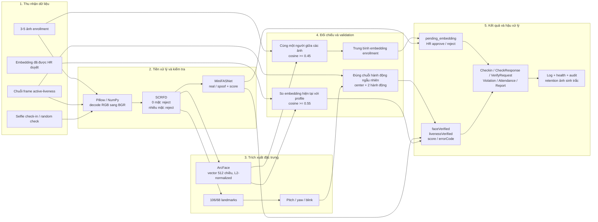
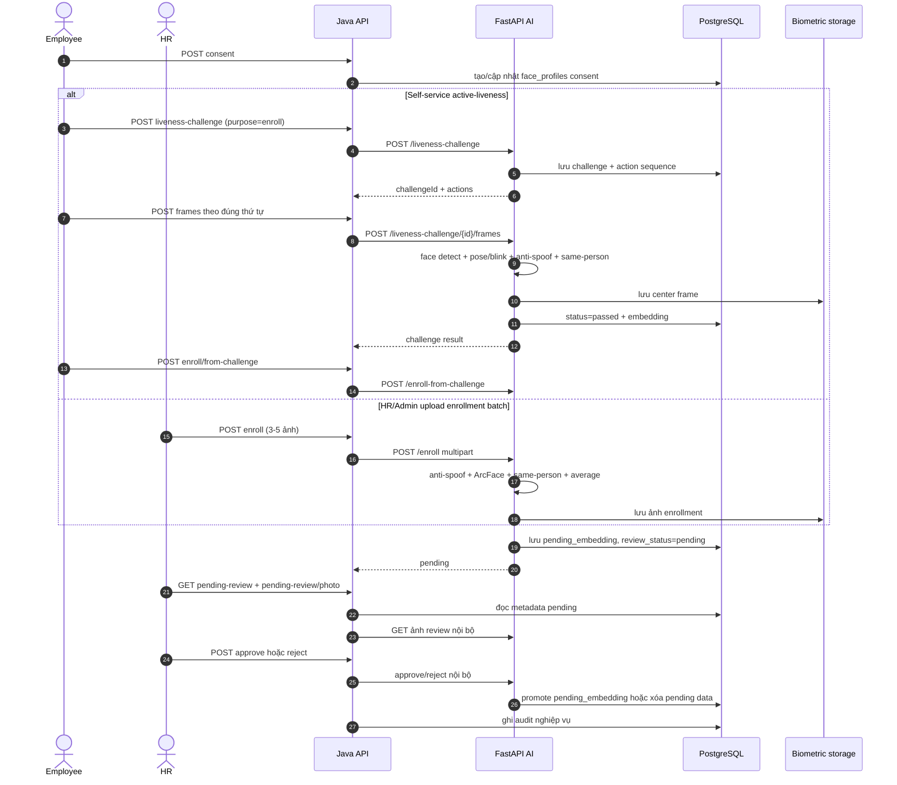
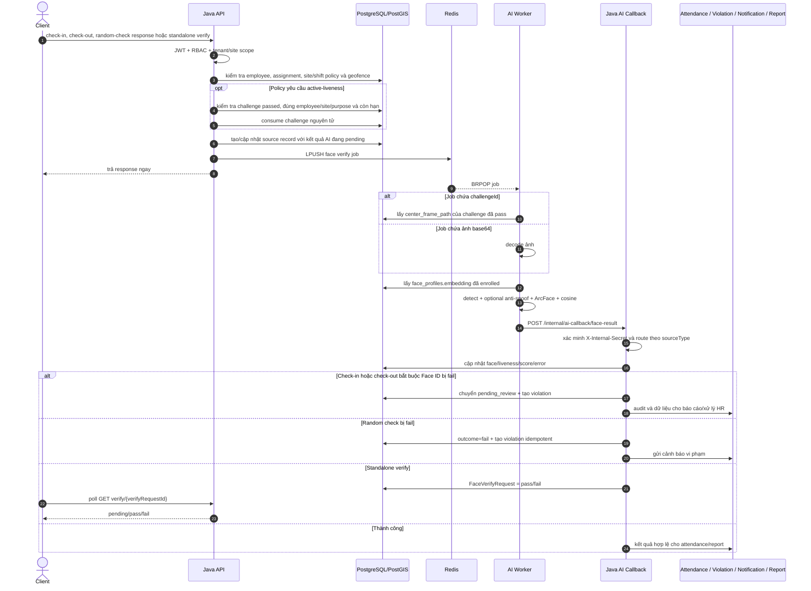

# Kiến trúc AI và tích hợp API của FAMS (as-is)

**Phạm vi:** Java API, Python AI service và các module nghiệp vụ nhận kết quả AI  
**Mức kiến trúc:** Container + Component + luồng runtime  
**Căn cứ:** mã nguồn trong repository, rà soát ngày 2026-08-20

> FAMS hiện không có LLM, prompt hay RAG như hình tham khảo. Thành phần AI là pipeline thị giác
> máy tính phục vụ Face ID, anti-spoofing và active-liveness. Vì vậy sơ đồ dưới đây giữ cách chia
> pipeline theo giai đoạn của hình tham khảo, nhưng thay bằng đúng thành phần đang chạy trong FAMS.

**Bản PlantUML để dán/import vào draw.io:**

- [`fams-ai-api-architecture.puml`](fams-ai-api-architecture.puml): kiến trúc tổng thể.
- [`fams-ai-enrollment-sequence.puml`](fams-ai-enrollment-sequence.puml): enrollment và HR review.
- [`fams-ai-verification-sequence.puml`](fams-ai-verification-sequence.puml): xác minh bất đồng bộ.

## 1. Sơ đồ kiến trúc tổng thể phía API

```mermaid
flowchart LR
    subgraph CLIENTS[Client và người dùng]
        APP[Web / Mobile App]
        EMP[Employee]
        OPS[HR / Supervisor / Admin]
        EMP --> APP
        OPS --> APP
    end

    subgraph API[Java API - Spring Boot :8080]
        SEC[REST Controllers<br/>JWT + RBAC + tenant/site scope]

        subgraph MODULES[Module nghiệp vụ liên quan AI]
            FACE[Employee / Face ID<br/>consent, enroll, review, verify]
            CHECKIN[Check-in / Check-out<br/>GPS + policy Face ID]
            RANDOM[Random Check<br/>location + face + liveness]
            CALLBACK[Internal AI Callback<br/>apply kết quả]
        end

        subgraph CONSUMERS[Module sử dụng kết quả]
            ATT[Attendance<br/>tổng hợp bảng công]
            VIO[Violation<br/>face/liveness fail]
            NOTI[Notification<br/>cảnh báo và retention job]
            REPORT[Dashboard / Report / Search]
            AUDIT[Audit / System Status]
        end

        AICLIENT[AiServiceClient<br/>HTTP đồng bộ]
        PUBLISHER[FaceVerifyJobPublisher<br/>LPUSH job]
    end

    subgraph AI[FAMS AI - FastAPI :5000 - CPU]
        INTERNAL[Internal REST API<br/>X-Internal-Secret]
        WORKER[Face Verify Worker<br/>BRPOP job]

        subgraph VISION[AI inference pipeline]
            DECODE[Decode và chuẩn hóa ảnh]
            DETECT[SCRFD<br/>phát hiện đúng 1 khuôn mặt]
            LIVE[MiniFASNet<br/>anti-spoofing]
            POSE[InsightFace landmarks<br/>head pose + blink]
            EMBED[ArcFace<br/>embedding 512 chiều]
            MATCH[Cosine similarity<br/>ngưỡng mặc định 0.55]
            VALIDATE[Validation<br/>same-person + challenge sequence]
        end

        SYNCRESULT[Kết quả đồng bộ<br/>enroll / challenge / review]
        ASYNCRESULT[Kết quả face verify<br/>face / liveness / score / error]
        CALLBACKCLIENT[Callback Client<br/>POST kết quả về Java]
        LOCAL[(Biometric photo storage<br/>enrollments / checkins / challenges)]
    end

    REDIS[(Redis 7<br/>fams:ai:face_verify_jobs)]
    DB[(PostgreSQL 16 / PostGIS<br/>face_profiles, liveness_challenges,<br/>checkins, responses, violations)]

    APP -->|HTTPS REST + JWT<br/>ảnh / frame / GPS| SEC
    SEC --> FACE
    SEC --> CHECKIN
    SEC --> RANDOM

    FACE -->|enroll, challenge, approve/reject,<br/>status, ảnh review| AICLIENT
    CHECKIN --> PUBLISHER
    RANDOM --> PUBLISHER
    FACE -->|standalone verify| PUBLISHER

    AICLIENT -->|HTTP nội bộ đồng bộ| INTERNAL
    PUBLISHER -->|JSON job, ảnh base64<br/>hoặc challengeId| REDIS
    REDIS -->|blocking consume| WORKER

    INTERNAL --> DECODE
    WORKER --> DECODE
    DECODE --> DETECT
    DETECT --> LIVE
    DETECT --> POSE
    DETECT --> EMBED
    LIVE --> VALIDATE
    POSE --> VALIDATE
    EMBED --> VALIDATE
    EMBED --> MATCH
    MATCH --> VALIDATE

    INTERNAL <-->|đọc/ghi trực tiếp dữ liệu sinh trắc| DB
    WORKER -->|đọc embedding đã duyệt| DB
    INTERNAL <-->|lưu/đọc/xóa ảnh| LOCAL
    WORKER -->|lưu ảnh minh chứng| LOCAL

    VALIDATE -->|REST inference| SYNCRESULT
    VALIDATE -->|worker inference| ASYNCRESULT
    SYNCRESULT -->|HTTP response| AICLIENT
    ASYNCRESULT --> CALLBACKCLIENT
    CALLBACKCLIENT -->|HTTP callback + shared secret| CALLBACK
    CALLBACK --> CHECKIN
    CALLBACK --> RANDOM
    CALLBACK --> FACE

    CHECKIN --> ATT
    CALLBACK --> VIO
    RANDOM --> VIO
    VIO --> NOTI
    CHECKIN --> REPORT
    RANDOM --> REPORT
    ATT --> REPORT
    VIO --> REPORT
    CALLBACK --> AUDIT
    NOTI -->|dọn ảnh và embedding đã revoke| AICLIENT
    AUDIT -.->|GET /health| INTERNAL

    FACE <-->|metadata trạng thái / consent / review| DB
    CHECKIN <-->|checkin record / policy / kết quả| DB
    RANDOM <-->|scheduled check / response| DB
    ATT <-->|attendance summary| DB
    VIO <-->|violation| DB
    REPORT -->|truy vấn read model| DB

    classDef client fill:#fff3cd,stroke:#b98b00,color:#111827;
    classDef java fill:#dbeafe,stroke:#2563eb,color:#111827;
    classDef ai fill:#dcfce7,stroke:#16a34a,color:#111827;
    classDef data fill:#f3f4f6,stroke:#6b7280,color:#111827;
    class APP,EMP,OPS client;
    class SEC,FACE,CHECKIN,RANDOM,CALLBACK,ATT,VIO,NOTI,REPORT,AUDIT,AICLIENT,PUBLISHER java;
    class INTERNAL,WORKER,DECODE,DETECT,LIVE,POSE,EMBED,MATCH,VALIDATE,SYNCRESULT,ASYNCRESULT,CALLBACKCLIENT ai;
    class REDIS,DB,LOCAL data;
```

### Cách đọc

- Client chỉ gọi Java API công khai. `fams-ai` là service nội bộ, không publish cổng ra host trong
  `docker-compose.full.yml`.
- Java API chịu trách nhiệm xác thực JWT, RBAC, tenant/site scope, geofence, policy chấm công và
  quyết định nghiệp vụ. AI service chỉ xử lý dữ liệu sinh trắc và trả kết quả kỹ thuật.
- HTTP đồng bộ dùng cho enrollment, active-liveness, duyệt/từ chối/revoke, đọc ảnh và trạng thái.
- Redis queue dùng cho face verification để request check-in/random check không phải chờ inference.
- AI callback cập nhật bản ghi nguồn theo `sourceType`: `checkin`, `checkout`, `check_response` hoặc
  `standalone_verify`.

## 2. Pipeline AI theo giai đoạn

## 3. Luồng enrollment và HR review

Điểm kiểm soát quan trọng: enrollment không tự kích hoạt profile. Chỉ khi HR/Admin approve thì
`pending_embedding` mới được chuyển thành `embedding` có `status=enrolled` để dùng khi chấm công.

## 4. Luồng xác minh bất đồng bộ và tác động toàn hệ thống

## 5. Bản đồ API công khai sang AI nội bộ

| Năng lực | API công khai trên Java | Giao tiếp Java -> AI | Kiểu xử lý |
|---|---|---|---|
| Consent và trạng thái Face ID | `POST /.../face-id/consent`, `GET /.../face-id` | DB Java; `GET /status/{employeeId}` khi cần đồng bộ trạng thái | Đồng bộ |
| Enrollment bằng ảnh | `POST /.../face-id/enroll` | `POST /enroll` multipart | Đồng bộ inference, kết quả `pending` |
| Active-liveness | `POST /.../liveness-challenge`, `POST /.../{challengeId}/frames` | Hai endpoint cùng tên trên FastAPI | Đồng bộ inference |
| Enrollment từ challenge | `POST /.../enroll/from-challenge` | `POST /enroll-from-challenge` | Đồng bộ, chờ HR review |
| HR review | `GET /face-id/pending-review`, `POST /.../approve`, `POST /.../reject` | Đọc DB + get photo + approve/reject nội bộ | Đồng bộ |
| Revoke | `DELETE /.../face-id` | `DELETE /enroll/{employeeId}` | Đồng bộ + retention bù lỗi |
| Standalone verify | `POST /.../face-id/verify` và poll `GET /.../verify/{id}` | Redis job + callback | Bất đồng bộ |
| Check-in / check-out | `POST /checkin`, `POST /checkin/{id}/checkout` | Redis job + callback | Bất đồng bộ |
| Random-check response | `POST /scheduled-checks/{id}/respond` | Redis job + callback | Bất đồng bộ |
| Xem ảnh minh chứng | API Java của check-in/random check | `GET /checkins/{sourceId}/photo` | Proxy đồng bộ sau khi kiểm tra quyền |
| Health và retention | Platform system status + weekly retention job | `GET /health`, cleanup photo, delete embedding | Nội bộ |

`/.../` trong bảng là tiền tố tenant/employee tương ứng; client không gọi trực tiếp các endpoint
FastAPI.

## 6. Ranh giới trách nhiệm và dữ liệu

| Thành phần | Trách nhiệm chính | Dữ liệu sở hữu/thao tác |
|---|---|---|
| Client | Chụp ảnh/frame, GPS, thực hiện action challenge, poll kết quả | Dữ liệu đầu vào tạm thời |
| Java API | AuthN/AuthZ, multi-tenant, site scope, geofence, policy, workflow HR, trạng thái nghiệp vụ | Toàn bộ entity nghiệp vụ và API contract |
| FastAPI AI | Phát hiện mặt, anti-spoof, head pose/blink, embedding, similarity | Raw embedding và file ảnh sinh trắc |
| Redis | Tách request API khỏi thời gian inference | Job JSON tạm thời |
| PostgreSQL/PostGIS | Nguồn dữ liệu bền vững dùng chung | Profile, challenge, checkin, response, violation, audit |
| Local biometric storage | Ảnh enrollment, center frame và ảnh minh chứng | File theo `tenantId` và `sourceId` |

Hiện tại AI service đọc/ghi trực tiếp `face_profiles` và `liveness_challenges` trong database do
Flyway phía Java quản lý. Đây là coupling có chủ ý trong kiến trúc as-is: thay đổi schema hai bảng
này phải được kiểm tra đồng thời với SQL trong Python.

## 7. Security, độ tin cậy và vận hành

- Public request đi qua Spring Security, JWT, permission và tenant/site scope; FastAPI business
  endpoint được bảo vệ bằng `X-Internal-Secret`.
- `GET /health` của AI không cần secret để Java health indicator kiểm tra liveness.
- `fams-ai:5000` chỉ chạy trong Docker network; Java API là cổng vào duy nhất của client.
- Callback cũng kiểm tra `X-Internal-Secret`; `tenantId` và `sourceType` quyết định bản ghi được cập nhật.
- Challenge có TTL 90 giây, gắn `tenantId`, `employeeId`, `purpose` và `siteId`; Java consume nguyên
  tử và chỉ chấp nhận challenge mới hoàn tất trong khoảng freshness nghiệp vụ.
- Active-liveness gồm frame `center` và hai hành động ngẫu nhiên không lặp; center frame còn được
  kiểm tra anti-spoof và tất cả frame phải cùng một người.
- Redis list hiện không thể hiện acknowledgement/dead-letter queue. Callback cũng chỉ log khi
  gửi thất bại và chưa có retry bền vững trong AI worker. `FaceVerifyTimeoutJob` chỉ đóng các
  random-check response bị treo; check-in/check-out và standalone verify chưa có cơ chế tương đương.
- Weekly retention job gọi AI để dọn ảnh check-in/challenge theo cấu hình tenant và xóa embedding
  còn sót của profile đã revoke. Ảnh enrollment pending chưa có DB-aware retention sweep.
- Logging hiện là application log; repository chưa có MLflow/model registry hoặc pipeline huấn
  luyện/đánh giá model độc lập như phần experimentation trong hình tham khảo.

## 8. Các quyết định kiến trúc thể hiện trên sơ đồ

1. **Java API là orchestration layer.** AI không tự quyết định một nhân viên có được chấm công hay
   có bị ghi vi phạm hay không.
2. **Inference nặng đi bất đồng bộ khi có thể.** Check-in, check-out và random check trả response
   trước; kết quả AI cập nhật sau qua callback.
3. **Active-liveness được tái sử dụng có kiểm soát.** Challenge đã pass cung cấp center frame cho
   face match, nhưng bị ràng buộc theo employee/site/purpose/thời gian và chỉ dùng một lần.
4. **Human-in-the-loop cho enrollment.** Kiểm tra tự động lọc ảnh lỗi/spoof; HR/Admin vẫn xác minh
   danh tính trước khi embedding được kích hoạt.
5. **Kết quả AI lan sang nghiệp vụ qua callback.** Face/liveness fail có thể tạo violation,
   chuyển check-in sang `pending_review`, phát notification và xuất hiện trong dashboard/report.

## 9. Implementation gap phát hiện khi đối chiếu sơ đồ

Luồng active-liveness cho check-in/check-out/random check hiện có một bất nhất trạng thái:

1. Java kiểm tra challenge có `status=passed`, sau đó `consumeIfPassed()` đổi nó thành `consumed`.
2. Java mới đẩy Redis job chứa `challenge_id`.
3. AI worker `_load_challenge_frame()` lại chỉ chấp nhận hàng có `status=passed`.

Vì worker chạy sau transaction Java, job từ challenge có thể trả `challenge_not_found` dù challenge
hợp lệ và đã được consume đúng. Contract nên được thống nhất theo một trong hai hướng: worker chấp
nhận `consumed` cho job đã được Java claim, hoặc job mang snapshot/path đã được xác thực để worker
không kiểm tra lại trạng thái mutable. Đây là lỗi implementation quan sát trực tiếp từ code, không
phải thay đổi kiến trúc đã được áp dụng trong tài liệu này.
