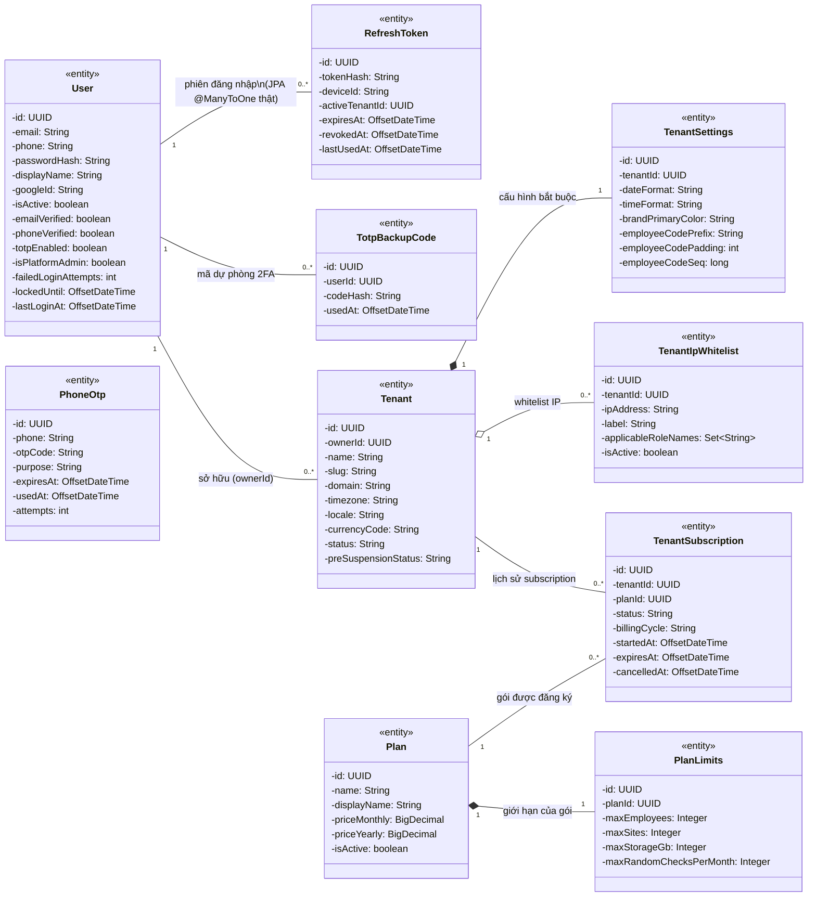
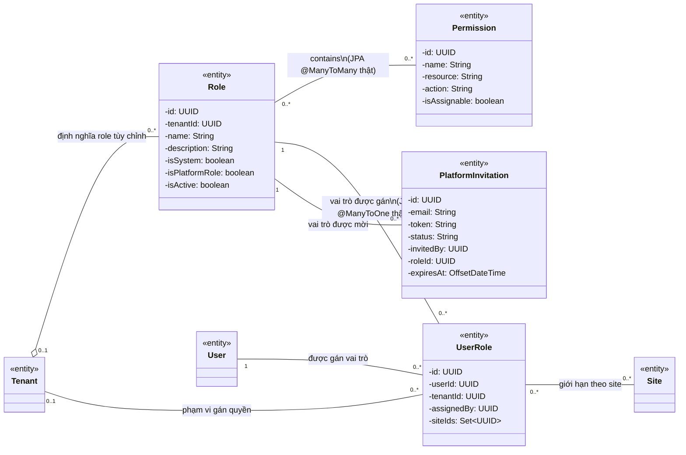
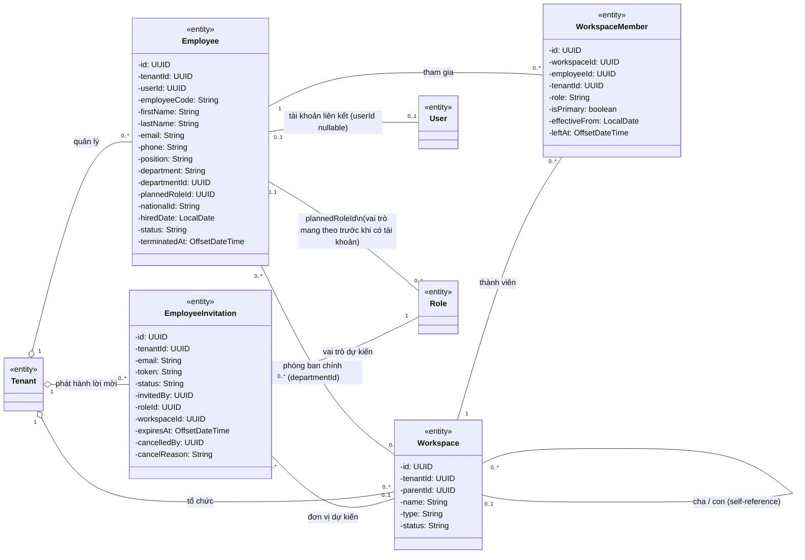
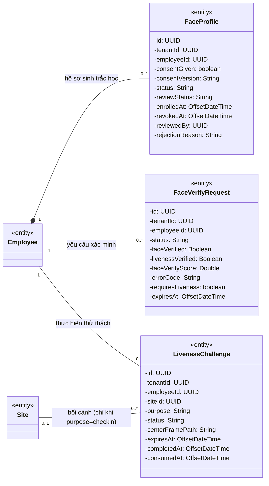
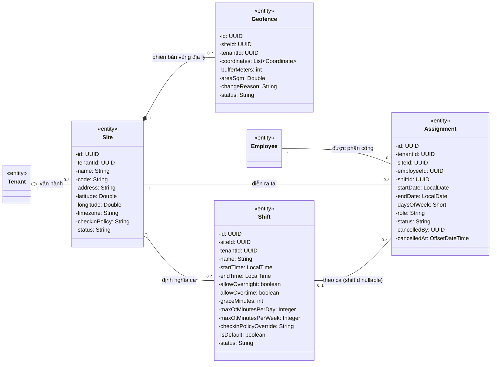
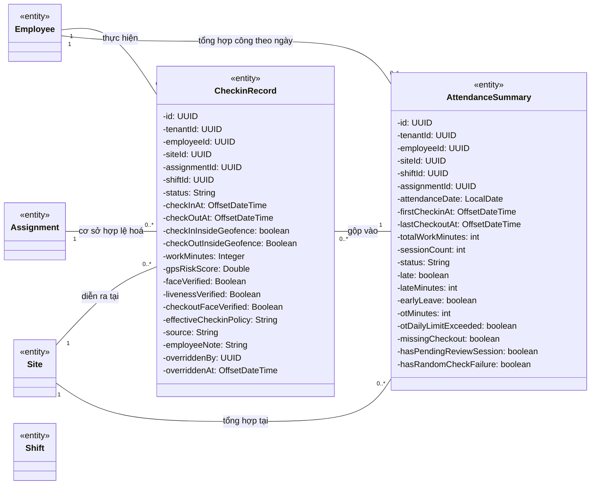
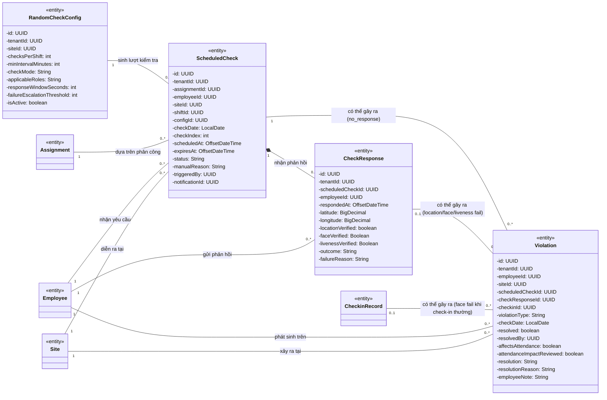
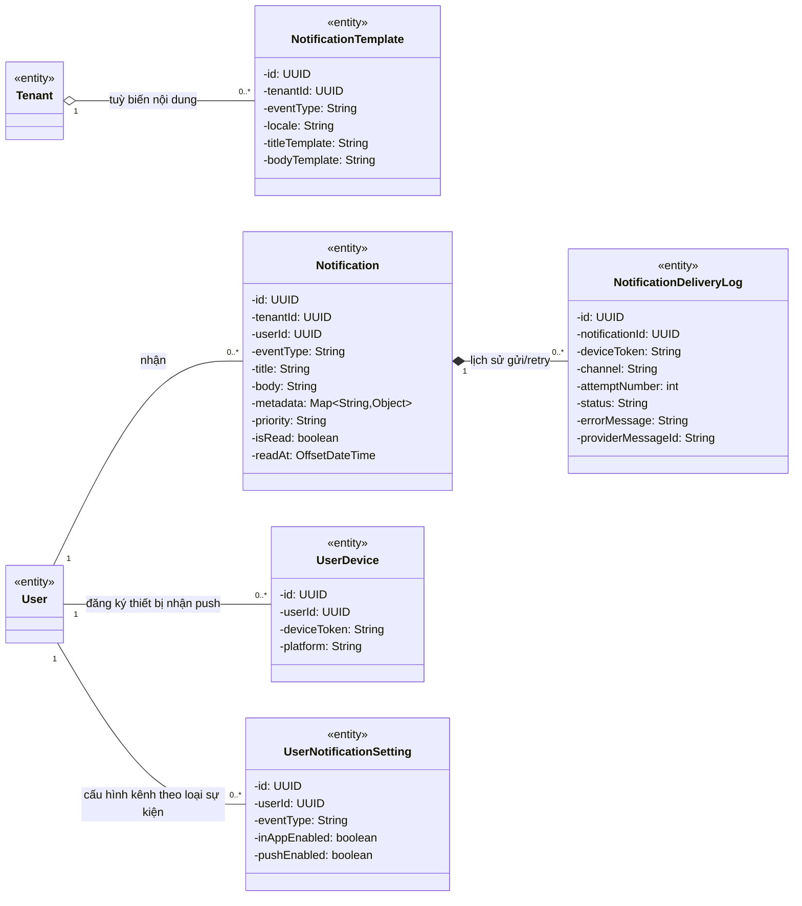
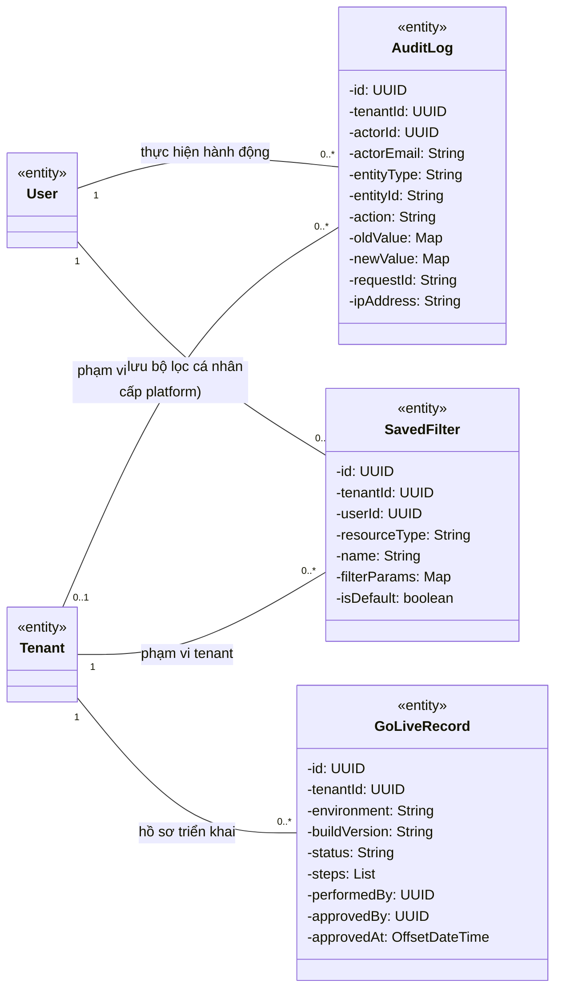

# Sơ đồ lớp hệ thống FAMS (Domain Model)

**Loại tài liệu:** UML Class Diagram mức phân tích (domain model thuần)

**Phạm vi:** Toàn bộ entity nghiệp vụ của FAMS Backend, tổ chức theo 8 miền (bounded context)

**Trạng thái:** As-is theo mã nguồn `api-server/src/main/java/com/fams/modules/**` tại ngày 2026-08-18

**Số lớp:** 34 entity nghiệp vụ (loại trừ `HealthCheck` — entity chẩn đoán kỹ thuật, không mang ngữ nghĩa nghiệp vụ)

## 1. Mục đích và phạm vi

Tài liệu mô tả **cấu trúc tĩnh của miền nghiệp vụ FAMS** — các đối tượng dữ liệu tồn tại trong hệ thống, thuộc tính và quan hệ giữa chúng. Đây là class diagram thuần domain model: chỉ vẽ `<<entity>>`, không lẫn Controller (Boundary) hay Service (Control). Hành vi nghiệp vụ (ai gọi service nào, luồng xử lý) được mô tả trong Use Case Diagram (`docs/architecture/use-cases/`) và Sequence Diagram — không lặp lại ở đây.

> Phiên bản trước của tài liệu này (đã xoá) trộn Boundary/Control/Entity vào một sơ đồ theo phong cách robustness diagram (ICONIX). Cách trình bày đó phù hợp cho thiết kế chi tiết nhưng không phải class diagram chuẩn học thuật — nó khiến sơ đồ vừa quá tải vừa không trả lời rõ câu hỏi "miền dữ liệu của FAMS trông như thế nào". Bản này tách hẳn: class diagram = domain model, còn Boundary/Control để lại cho tài liệu thiết kế API/service khi cần.

## 2. Quy ước UML

| Ký hiệu | Ý nghĩa |
|---|---|
| `-` | Thuộc tính private |
| `..>` | Dependency: lớp nguồn tham chiếu lớp đích nhưng không sở hữu vòng đời |
| `--` | Association: hai đối tượng có liên hệ nghiệp vụ hai chiều hoặc một chiều điều hướng được |
| `o--` | Aggregation: tập hợp quản lý, phần tử có vòng đời độc lập, có thể tách khỏi lớp cha |
| `*--` | Composition: phần tử phụ thuộc vòng đời vào lớp chủ, xoá cha kéo theo xoá con |
| `<|--` | Generalization/kế thừa |
| `1`, `0..1`, `0..*`, `1..*` | Bội số của quan hệ, đọc ở đầu tương ứng |

### Quy ước riêng của FAMS: quan hệ qua UUID vs. quan hệ JPA thật

Khảo sát mã nguồn cho thấy **chỉ 3 quan hệ trong toàn hệ thống là JPA association thật** (`@ManyToOne`/`@ManyToMany` có `@JoinColumn`, điều hướng được bằng `entity.getX()`):

1. `RefreshToken.user` → `User` (`@ManyToOne`)
2. `UserRole.role` → `Role` (`@ManyToOne`)
3. `Role.permissions` → `Set<Permission>` (`@ManyToMany` qua bảng `role_permissions`)

**Toàn bộ quan hệ còn lại** (Employee↔Tenant, Assignment↔Employee/Site/Shift, CheckinRecord↔Assignment, Violation↔Employee/Site/ScheduledCheck, v.v.) được lưu bằng **cột `UUID xxxId` thuần**, không có `@ManyToOne`/`@JoinColumn` — service tự tra cứu qua repository. Sơ đồ vẫn vẽ các quan hệ này bằng association vì chúng biểu diễn quan hệ nghiệp vụ thật, nhưng đây **không phải** JPA object graph — không thể `entity.getParent()` trực tiếp. Ghi chú này áp dụng cho mọi association không được đánh dấu riêng.

Không có kế thừa (`@Inheritance`) giữa bất kỳ entity nào trong toàn bộ codebase.

## 3. Miền Định danh, Tenant, Subscription

**Ghi chú nghiệp vụ:**
- `User` không có `tenantId` — danh tính đăng nhập là cross-tenant; quan hệ với tenant chỉ hình thành gián tiếp qua `UserRole` (mục 5) hoặc trực tiếp qua `Tenant.ownerId`.
- `TenantSubscription` là composition về mặt dữ liệu lịch sử (1 tenant có nhiều bản ghi subscription theo thời gian), subscription "đang hiệu lực" được xác định bằng `status = ACTIVE` chứ không phải bằng một cột FK riêng "current subscription".
- `PhoneOtp` không tham chiếu `User` (OTP theo số điện thoại, dùng cả cho luồng đăng ký lẫn đăng nhập, trước khi có `User`).

## 4. Miền RBAC (Vai trò và Quyền)

**Ghi chú nghiệp vụ:**
- `UserRole` là **association class** của quan hệ nhiều–nhiều giữa `User` và `Role`, mang thêm thuộc tính nghiệp vụ: `tenantId` (phạm vi — `null` nghĩa là gán quyền cấp platform), `assignedBy` (ai gán) và `siteIds` (giới hạn site cho vai trò site-scoped, ví dụ Site Supervisor chỉ áp dụng ở một số site thay vì toàn tenant).
- `Tenant "0..1"` ở hai đầu quan hệ với `Role` và `UserRole` vì role/gán-role cấp platform (`PLATFORM_ADMIN`, `PLATFORM_STAFF`) không thuộc tenant nào (`tenantId = null`).
- RBAC là **mô hình phẳng dựa trên chuỗi permission** (`resource:action`, ví dụ `employees:list`), không có class hierarchy `Admin`/`Employee` trong code. 7 role hệ thống (`PLATFORM_ADMIN`, `PLATFORM_STAFF`, `TENANT_ADMIN`, `HR_MANAGER`, `SITE_SUPERVISOR`, `EMPLOYEE`) là **dữ liệu** (bản ghi `Role` với `isSystem=true`), không phải subclass; tenant có thể tạo thêm role tùy chỉnh với tập permission tùy ý.

## 5. Miền Nhân sự và Tổ chức

**Ghi chú nghiệp vụ:**
- `EmployeeInvitation` tồn tại **trước** `Employee` (invitation được chấp nhận thì mới tạo `Employee` + `User`), nên không có FK trực tiếp `EmployeeInvitation → Employee`.
- `Employee.plannedRoleId` cho phép gán trước vai trò RBAC cho một nhân viên được mời, áp dụng khi họ chấp nhận lời mời và có tài khoản `User`.
- `departmentId` (phòng ban chính, dùng cho báo cáo/tổ chức) và quan hệ qua `WorkspaceMember` (lịch sử/đa vai trò trong nhiều workspace) là hai cơ chế song song — `departmentId` là tham chiếu nhanh, `WorkspaceMember` là bản ghi đầy đủ có `effectiveFrom`/`leftAt`.

## 6. Miền Face ID và Liveness

**Ghi chú nghiệp vụ:**
- `FaceProfile` là composition với `Employee`: hồ sơ Face ID không có ý nghĩa tồn tại độc lập, và bị xoá/thu hồi cùng vòng đời nhân viên.
- Embedding sinh trắc học thô (vector khuôn mặt) **không được map trong Java** — cột này do `fams-ai` (Python, qua `psycopg2`) sở hữu trực tiếp, Java chỉ giữ metadata (`status`, `consentGiven`, thời điểm). Đây là ranh giới cố ý giữa hai service, không phải thiếu sót khi thiết kế entity.
- `LivenessChallenge.siteId` chỉ có giá trị khi `purpose` liên quan đến check-in (bối cảnh xác định site đang chấm công); các purpose khác (ví dụ enroll) để `null`.

## 7. Miền Site, Ca làm và Phân công

**Ghi chú nghiệp vụ:**
- `Geofence` là composition: mỗi lần đổi vùng địa lý tạo bản ghi mới (`status`, `changeReason`) thay vì sửa tại chỗ — đúng ngữ nghĩa "phiên bản", các phiên bản cũ không tồn tại độc lập ngoài site chủ.
- `Shift.checkinPolicyOverride` cho phép một ca có chính sách chấm công (`gps_only`/`gps_face`/`gps_face_liveness`) khác với `Site.checkinPolicy` mặc định — chính sách hiệu lực = `shift.checkinPolicyOverride ?? site.checkinPolicy`, được service tính tại thời điểm check-in.
- `Assignment.shiftId` có thể `null` (phân công không gắn ca cố định).

## 8. Miền Check-in và Bảng công

**Ghi chú nghiệp vụ:**
- `CheckinRecord` lưu **snapshot** toàn bộ thông số ca (giờ bắt đầu/kết thúc, grace, OT tối đa...) tại thời điểm check-in — không đọc lại `Shift` khi tính công sau này, kể cả khi `Shift` bị sửa. Điều này cố ý đảm bảo tính lại công không bị thay đổi ngược bởi cấu hình ca mới.
- `AttendanceSummary` là **entity dẫn xuất** (derived) — không được tạo/sửa trực tiếp bởi hành động người dùng, chỉ được ghi bởi service tổng hợp (`AttendanceSummaryService`) hoặc job định kỳ, dựa trên các `CheckinRecord` trong ngày.
- HR có thể "override" một `CheckinRecord` (đổi trạng thái, ghi lý do) và "adjust" một `AttendanceSummary` — đây là hành vi service, không làm phát sinh entity mới.

## 9. Miền Random Check và Vi phạm

**Ghi chú nghiệp vụ:**
- `Violation` có **3 nguồn phát sinh khác nhau**, thể hiện bằng 3 FK tùy chọn: `scheduledCheckId` (không phản hồi kịp — `no_response`), `checkResponseId` (phản hồi nhưng verify thất bại — `location_fail`/`face_fail`/`liveness_fail`/`face_verify_timeout`), và `checkinId` (check-in thường thất bại xác minh khuôn mặt khi site/ca yêu cầu Face ID — `face_fail`/`liveness_fail`). Không có Violation nào thiếu cả 3 nguồn.
- `Violation` **không có FK trực tiếp tới `AttendanceSummary`** — ảnh hưởng lên bảng công (`affectsAttendance`) là một **cờ nghiệp vụ được HR xác nhận thủ công** (`attendanceImpactReviewed`), liên kết logic qua `employeeId` + `checkDate`, không phải quan hệ dữ liệu cứng. Vì vậy sơ đồ **không vẽ association `Violation → AttendanceSummary`** như phiên bản trước — đó là điểm sai đã sửa.
- Toàn bộ vi phạm do **hệ thống tự động tạo** (qua các service/job xử lý phản hồi và hết hạn), không có use case "tạo vi phạm thủ công" ở tầng người dùng.

## 10. Miền Thông báo

**Ghi chú nghiệp vụ:**
- `Notification.priority` là **snapshot** được resolve từ danh mục loại sự kiện (`NotificationEventTypeCatalog`, 11 loại) tại thời điểm tạo — sửa danh mục sau đó không ảnh hưởng thông báo đã gửi.
- Kênh gửi thực tế: **in-app** (luôn có, là chính bản ghi `Notification`), **push** qua FCM (`UserDevice.deviceToken`), **email** chỉ dùng làm **fallback** khi push thất bại (thể hiện qua trạng thái `FALLBACK_EMAIL_SENT`/`FALLBACK_EMAIL_FAILED` trong `NotificationDeliveryLog` — không có kênh email chọn được độc lập, nên `UserNotificationSetting` chỉ có `inAppEnabled`/`pushEnabled`, không có `emailEnabled`).
- Notification được tạo bởi service nghiệp vụ khác (Violation, Checkin, RandomCheck, Employee Invitation, RBAC role assignment...) — các module đó phụ thuộc (`..>`) vào miền Notification, không sở hữu entity của nó.

## 11. Miền hỗ trợ (Audit, Saved Filter, Go-Live)

**Ghi chú nghiệp vụ:**
- `AuditLog.entityType`/`entityId` là tham chiếu **đa hình** (polymorphic) bằng chuỗi tới bất kỳ entity nào trong hệ thống, không phải FK tới một class cụ thể — vì vậy không vẽ được association tới toàn bộ entity nghiệp vụ mà chỉ ghi chú tại đây.
- `GoLiveRecord` là artifact tuân thủ vận hành nội bộ (checklist go-live theo môi trường/tenant), không phải đối tượng nghiệp vụ chấm công — liệt kê để đầy đủ nhưng không phải trọng tâm domain model.

## 12. Đối chiếu với mã nguồn

| Miền | Package nguồn |
|---|---|
| Định danh, Tenant, Subscription | `com.fams.modules.auth`, `tenant`, `subscription` |
| RBAC | `com.fams.modules.rbac` |
| Nhân sự và Tổ chức | `com.fams.modules.employee`, `workspace` |
| Face ID | `com.fams.modules.employee` (FaceProfile, FaceVerifyRequest, LivenessChallenge cùng package employee) |
| Site, Ca, Phân công | `com.fams.modules.site`, `geofence`, `shift`, `assignment` |
| Check-in và Bảng công | `com.fams.modules.checkin`, `attendance` |
| Random Check và Vi phạm | `com.fams.modules.randomcheck`, `violation` |
| Thông báo | `com.fams.modules.notification` |
| Hỗ trợ | `com.fams.modules.audit`, `savedfilter`, `golive` |

`dashboard` và `report` **không có entity riêng** — đây là lớp tổng hợp/đọc dữ liệu (aggregation) trên các entity đã liệt kê (Employee, Site, CheckinRecord, AttendanceSummary, Violation, Assignment...), nên không xuất hiện trong domain model. Vai trò của chúng được mô tả ở Use Case Diagram mục "Dashboard, báo cáo, tìm kiếm và bộ lọc".

Nguồn dùng để kiểm chứng sơ đồ:

- [Conceptual ERD](./conceptual-erd.md): thuật ngữ, thực thể và bội số nghiệp vụ ở mức khái niệm cao hơn (không phân biệt UUID-ref vs JPA thật).
- [System Context](./fams-system-context.md): biên hệ thống và tích hợp bên ngoài.
- [Use Case Diagrams](./use-cases/): hành vi actor–use case tương ứng với các entity ở đây.
- `api-server/src/main/java/com/fams/modules`: 37 class `@Entity` hiện hành (34 được vẽ, loại `HealthCheck`).
