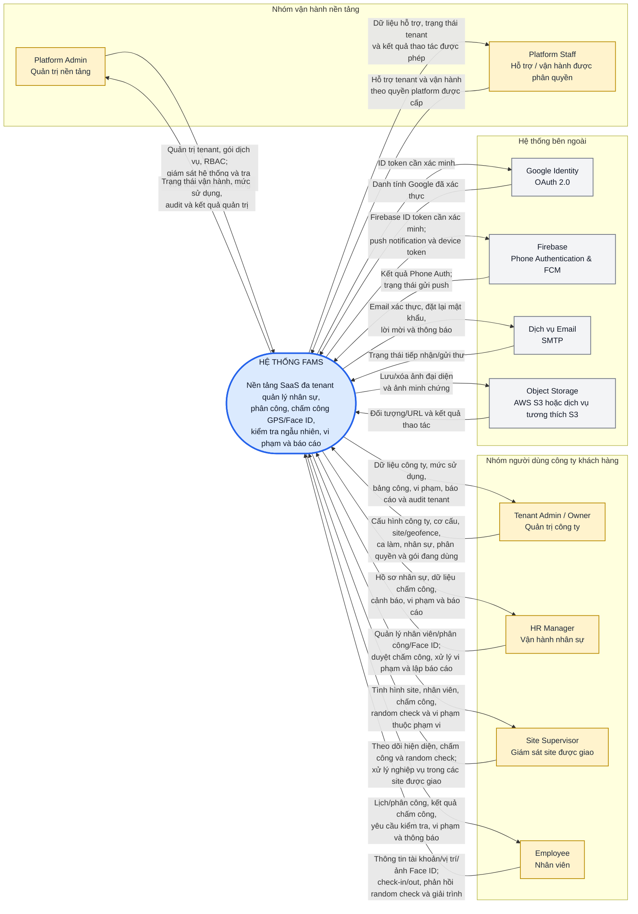

# FAMS System Context Diagram (as-is)

**Phạm vi:** toàn bộ nền tảng FAMS (Web/Mobile client, Java API và AI service)  
**Mức kiến trúc:** System Context — chỉ thể hiện FAMS, các tác nhân/hệ thống bên ngoài và luồng trao đổi cấp cao  
**Căn cứ:** mã nguồn và tài liệu trong repository, rà soát ngày 2026-08-17

> Bản PlantUML để import và chỉnh sửa trong draw.io: [`fams-system-context.puml`](./fams-system-context.puml).

## Sơ đồ chính thức

## Cách đọc và ranh giới

- `FAMS` là **một hệ thống duy nhất** tại mức context. Web/Mobile, Java modular monolith, Python AI service, PostgreSQL/PostGIS, Redis và scheduler đều ở bên trong ranh giới này.
- Các khối màu vàng là **vai trò bên ngoài** tương tác với FAMS. Quyền thực tế vẫn do RBAC quyết định; một người có thể giữ vai trò khác nhau tại nhiều tenant.
- Các khối màu xám là **hệ thống do bên khác quản lý** mà FAMS trao đổi dữ liệu trực tiếp.
- Mũi tên mô tả **luồng thông tin/ý định nghiệp vụ cấp cao**, không phải màn hình, endpoint hay chuỗi gọi nội bộ.
- `Site Supervisor` bị giới hạn theo site được gán; các vai trò tenant chỉ thao tác trong tenant đang active.
- `Platform Staff` là nhóm khái quát cho `PLATFORM_STAFF` và vai trò platform tùy biến. Khả năng cụ thể phụ thuộc permission được cấp, không mặc nhiên bằng Platform Admin.

## Vì sao điều chỉnh sơ đồ tham khảo

1. **Giữ đúng một hệ thống trung tâm.** Sơ đồ context không phân rã FAMS thành API, AI, database, cache hay module nghiệp vụ.
2. **Tách người dùng khỏi hệ thống ngoài.** Platform/Tenant/HR/Supervisor/Employee là actor; Google, Firebase, SMTP và object storage là external software system.
3. **Gộp thao tác chi tiết thành năng lực cấp cao.** “Đăng nhập”, “tạo tenant”, “check-in”, “xem dashboard” là use case/API flow; nếu đưa tất cả vào đây sơ đồ sẽ mất chức năng định nghĩa phạm vi.
4. **Không dùng nhãn chung “Dịch vụ bên thứ 3”.** Mỗi tích hợp có trách nhiệm và dữ liệu trao đổi khác nhau nên phải được định danh riêng.
5. **Không đưa thành phần nội bộ ra ngoài ranh giới.** AI Face ID/liveness là companion service do FAMS vận hành và là một phần của sản phẩm; MinIO ở môi trường dev cũng là hạ tầng nội bộ.

## Đối chiếu với hiện trạng hệ thống

| Thành phần trên sơ đồ | Bằng chứng trong repository |
|---|---|
| Sáu nhóm vai trò | Flyway/seed RBAC và `docs/user-guides/huong-dan-su-dung-theo-vai-tro.md` |
| Google Identity | `GoogleLoginService` xác minh Google ID token |
| Firebase Phone Auth | `FirebasePhoneLoginService` xác minh Firebase ID token; client thực hiện OTP trực tiếp với Firebase |
| Firebase Cloud Messaging | `FcmClient` gửi push notification qua Firebase Admin SDK |
| Email SMTP | `EmailService` dùng `JavaMailSender` cho xác thực, reset mật khẩu và lời mời |
| Object storage | `AvatarStorageService` và `ExplanationEvidenceStorageService` dùng AWS SDK S3; dev dùng MinIO tương thích S3 |
| AI nằm trong FAMS | Java gọi FastAPI qua HTTP/Redis queue; AI service không publish port ra host trong full stack |

## Những đối tượng chủ ý không vẽ

- **PostgreSQL/PostGIS, Redis, AI service, background jobs:** thành phần nội bộ, phù hợp với Container Diagram.
- **Web Admin/Mobile App:** kênh truy cập thuộc sản phẩm FAMS trong phạm vi đã chọn. Nếu phạm vi cần mô tả riêng “FAMS Backend”, hai client này phải được đưa ra ngoài như external systems.
- **GPS/camera/thiết bị người dùng:** nguồn dữ liệu do Employee sử dụng, không phải một hệ thống độc lập trao đổi qua integration contract.
- **“Hệ thống bên thứ ba” không định danh:** repository có endpoint tạo notification được bảo vệ bằng shared secret, nhưng chưa xác định một hệ thống nghiệp vụ bên ngoài cụ thể đang sử dụng; không nên thêm actor suy đoán vào sơ đồ as-is.

## Sơ đồ tiếp theo nên tách riêng

Context Diagram chỉ trả lời “FAMS phục vụ ai và phụ thuộc hệ thống nào”. Chi tiết Java API, AI service, PostgreSQL, Redis, S3 và các giao thức HTTP/queue nên dùng **Container Diagram** hiện có tại `docs/02-kien-truc-du-an.md`. Luồng check-in, Face ID, random check và xử lý vi phạm nên dùng **Sequence/Activity Diagram**, không mở rộng thêm vào sơ đồ này.
