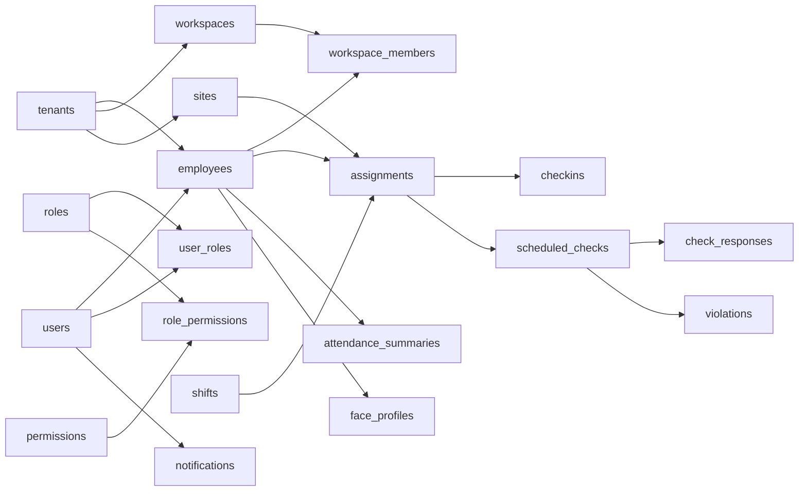

# Mô hình ERD mức thiết kế cơ sở dữ liệu của hệ thống FAMS

**Loại tài liệu:** Logical Database Design / Logical ERD  
**Phạm vi:** Toàn bộ nền tảng FAMS  
**Trạng thái mô tả:** As-is theo mã nguồn và Flyway migration `V1`–`V105` tại ngày 2026-08-18  
**Cơ sở đối chiếu:** [`conceptual-erd.md`](./conceptual-erd.md), các JPA entity và `api-server/src/main/resources/db/migration`

## 1. Mục đích và nguyên tắc chuyển đổi

Sau giai đoạn phân tích nghiệp vụ, các thực thể trong ERD mức phân tích được chuyển thành các bảng quan hệ. Mỗi bản ghi nghiệp vụ chính có khóa định danh; quan hệ `1:N` được triển khai bằng khóa ngoại ở bảng phía nhiều; quan hệ `N:M` được tách thành bảng trung gian. Những bảng trung gian có thuộc tính và vòng đời riêng, chẳng hạn `assignments` hoặc `workspace_members`, được xem là thực thể liên kết.

Thiết kế hướng đến chuẩn 3NF:

- dữ liệu tài khoản, tenant, nhân viên, site, ca và quyền được lưu ở các bảng độc lập;
- thuộc tính không khóa phụ thuộc vào khóa của chính bảng đó;
- tập giá trị lặp được tách thành bảng con hoặc bảng nối;
- các dữ liệu lịch sử cần giữ nguyên được lưu dưới dạng snapshot có chủ đích, không phải lặp dữ liệu tùy tiện;
- khóa duy nhất, `NOT NULL`, `CHECK`, FK, partial unique index và soft delete bảo vệ tính toàn vẹn theo vòng đời thực tế.

PostgreSQL là hệ quản trị dữ liệu quan hệ của hệ thống. Khóa kỹ thuật chủ yếu dùng `UUID`; thời điểm dùng `TIMESTAMPTZ`; dữ liệu cấu hình linh hoạt dùng `JSONB`; tọa độ và bán kính geofence dùng kiểu số/PostGIS phù hợp. Các bảng nghiệp vụ thường có `created_at`, `updated_at` và, nếu hỗ trợ xóa mềm, `deleted_at`.

## 2. Quy ước

| Ký hiệu | Ý nghĩa |
|---|---|
| PK | Khóa chính |
| FK | Khóa ngoại được database cưỡng chế |
| UK | Khóa/ràng buộc duy nhất |
| FK logic | Quan hệ được ứng dụng sử dụng nhưng migration hiện chưa tạo FK vật lý |
| `tenant_id` | Ranh giới sở hữu và cô lập dữ liệu tenant |
| `deleted_at` | Bản ghi xóa mềm; các unique index nghiệp vụ thường chỉ xét bản ghi chưa xóa |

Tên bảng và cột trong tài liệu giữ nguyên tiếng Anh để đối chiếu trực tiếp với schema. Phần “thuộc tính chính” liệt kê các cột mang ý nghĩa nghiệp vụ, khóa và snapshot; các cột audit lặp lại được mô tả chung thay vì lặp ở mọi dòng.

## 3. Sơ đồ quan hệ logic tổng quát



Đây là sơ đồ rút gọn để thể hiện trục liên kết chính. Các bảng chi tiết và bội số đầy đủ được liệt kê ở các mục sau.

## 4. Thiết kế các bảng dữ liệu

### 4.1. Tài khoản và xác thực

| Bảng | Khóa và quan hệ | Thuộc tính chính | Ý nghĩa |
|---|---|---|---|
| `users` | PK `id`; UK `email`, `phone` | `password_hash`, `google_id`, `display_name`, thông tin hồ sơ, trạng thái xác minh, TOTP, khóa tài khoản, cờ platform admin, `last_login_at` | Tài khoản đăng nhập dùng chung toàn platform |
| `refresh_tokens` | PK `id`; FK `user_id → users.id`; UK `token_hash`; `active_tenant_id` là FK logic | thiết bị, IP, user agent, thời hạn, thời điểm thu hồi | Phiên đăng nhập dài hạn và tenant đang hoạt động |
| `totp_backup_codes` | PK `id`; FK `user_id → users.id` | `code_hash`, `used_at` | Mã khôi phục 2FA dùng một lần |
| `phone_otps` | PK `id` | `phone`, `otp_code`, `purpose`, thời hạn, số lần thử, IP, `used_at` | OTP cho đăng ký/đăng nhập/xác minh số điện thoại |

`users 1:N refresh_tokens`, `users 1:N totp_backup_codes`. `phone_otps` cố ý chưa liên kết `users` vì OTP có thể được tạo trước khi tài khoản tồn tại.

### 4.2. Tenant, cấu hình và thuê bao

| Bảng | Khóa và quan hệ | Thuộc tính chính | Ý nghĩa |
|---|---|---|---|
| `tenants` | PK `id`; FK `owner_id → users.id`; UK có điều kiện `slug`, `domain` | tên, logo, ngành, quốc gia, múi giờ, locale, tiền tệ, trạng thái, trạng thái trước tạm ngưng | Doanh nghiệp và biên cô lập dữ liệu |
| `tenant_settings` | PK `id`; FK+UK `tenant_id → tenants.id` | định dạng ngày/giờ, màu thương hiệu, tiền tố và độ dài mã nhân viên | Cấu hình một-một của tenant |
| `tenant_ip_whitelists` | PK `id`; FK `tenant_id → tenants.id` | `ip_address`, nhãn, trạng thái | IP/dải IP được phép của tenant |
| `tenant_ip_whitelist_roles` | PK (`ip_whitelist_id`, `role_name`); FK `ip_whitelist_id → tenant_ip_whitelists.id` | `role_name` | Phạm vi vai trò áp dụng cho một IP whitelist |
| `plans` | PK `id`; UK có điều kiện `name` | tên hiển thị, mô tả, giá tháng/năm, thứ tự, trạng thái | Gói dịch vụ của platform |
| `plan_limits` | PK `id`; FK+UK `plan_id → plans.id` | giới hạn nhân viên, site, lưu trữ, random check | Bộ hạn mức một-một của gói |
| `tenant_subscriptions` | PK `id`; FK+UK `tenant_id → tenants.id`; FK `plan_id → plans.id` | trạng thái, chu kỳ, ngày bắt đầu/hết hạn/hủy | Gói hiện hành của tenant |

Quan hệ chính: `users 1:N tenants` qua chủ sở hữu; `tenants 1:1 tenant_settings`; `plans 1:1 plan_limits`; `plans 1:N tenant_subscriptions`; schema hiện hành giới hạn mỗi tenant có một bản ghi thuê bao.

### 4.3. RBAC và lời mời

| Bảng | Khóa và quan hệ | Thuộc tính chính | Ý nghĩa |
|---|---|---|---|
| `permissions` | PK `id`; UK `name` | `resource`, `action`, mô tả, khả năng gán | Quyền nguyên tử |
| `roles` | PK `id`; FK tùy chọn `tenant_id → tenants.id`; UK tên theo phạm vi | tên, mô tả, cờ system/platform tier/active | Vai trò hệ thống hoặc tùy chỉnh của tenant |
| `role_permissions` | PK (`role_id`, `permission_id`); hai cột đồng thời là FK | — | Bảng nối N:M giữa vai trò và quyền |
| `user_roles` | PK `id`; FK `user_id`, `role_id`, `tenant_id`, `assigned_by`; UK (`user_id`, `role_id`, `tenant_id`) | phạm vi, thời điểm gán, soft delete | Thực thể gán vai trò cho người dùng trong tenant |
| `user_role_sites` | PK (`user_role_id`, `site_id`); hai cột đồng thời là FK | — | Giới hạn một lần gán vai trò vào nhiều site |
| `employee_invitations` | PK `id`; FK `tenant_id`, `invited_by`, `role_id`; `workspace_id`, `cancelled_by` là FK logic; UK `token` | email/phone, họ tên, trạng thái, vai trò dự kiến, thời hạn, thông tin hủy | Lời mời tham gia một tenant |
| `platform_invitations` | PK `id`; FK `invited_by`, `role_id`; UK `token` | email, họ tên, trạng thái, thời hạn | Lời mời nhân sự vận hành platform, không thuộc tenant |

`roles N:M permissions` được chuyển thành `role_permissions`. `users N:M roles` được chuyển thành `user_roles`; bảng này có khóa riêng vì lần gán có người thực hiện, tenant, site scope và vòng đời. `user_roles N:M sites` tiếp tục được tách qua `user_role_sites`.

### 4.4. Tổ chức và nhân sự

| Bảng | Khóa và quan hệ | Thuộc tính chính | Ý nghĩa |
|---|---|---|---|
| `employees` | PK `id`; FK `tenant_id`, `user_id`, `department_id → workspaces.id`; UK có điều kiện (`tenant_id`,`user_id`) và (`tenant_id`,`employee_code`) | mã nhân viên, họ tên, email, điện thoại, chức danh, nhãn phòng ban, giấy tờ, ngày tuyển/nghỉ, vai trò dự kiến, trạng thái | Hồ sơ lao động riêng theo tenant |
| `workspaces` | PK `id`; FK `tenant_id`, self-FK `parent_id`, FK `created_by` | tên, mô tả, loại department/team, trạng thái | Cây đơn vị tổ chức |
| `workspace_members` | PK `id`; FK `workspace_id`, `employee_id`, `tenant_id`, `assigned_by`; UK có điều kiện (`workspace_id`,`employee_id`) | vai trò trong đơn vị, cờ đơn vị chính, ngày hiệu lực bắt đầu/kết thúc | Bảng nối N:M nhân viên–workspace |

`users 1:N employees` về mặt toàn platform, nhưng UK bảo đảm một tài khoản chỉ có tối đa một hồ sơ đang hiệu lực trong mỗi tenant. `workspaces` tự liên kết `1:N` để tạo cây tổ chức. Bảng `departments` cũ đã được migration `V71` hợp nhất và xóa; `employees.department_id` hiện tham chiếu `workspaces`, còn `employees.department` chỉ là nhãn cache phục vụ tương thích/lịch sử.

### 4.5. Site, geofence, ca và phân công

| Bảng | Khóa và quan hệ | Thuộc tính chính | Ý nghĩa |
|---|---|---|---|
| `sites` | PK `id`; FK `tenant_id`, `created_by`; UK có điều kiện tên trong tenant | tên, mã, địa chỉ, tọa độ, múi giờ, trạng thái, chính sách check-in/Face ID | Địa điểm làm việc |
| `geofences` | PK `id`; FK `site_id`, `tenant_id`, `created_by` | tọa độ, bán kính, trạng thái, lý do thay đổi vùng | Vùng địa lý hợp lệ của site |
| `shifts` | PK `id`; FK `site_id`, `tenant_id`, `created_by` | tên, giờ bắt đầu/kết thúc, nghỉ, qua đêm, grace/OT, trạng thái, ca mặc định | Cấu hình ca làm tại site |
| `assignments` | PK `id`; FK `tenant_id`, `site_id`, `employee_id`, `shift_id`, `created_by`, `cancelled_by` | ngày hiệu lực, ngày trong tuần, vai trò, trạng thái, thông tin hủy | Thực thể nối nhân viên với site và ca theo thời gian |

Quan hệ nghiệp vụ `employees N:M sites` không lưu trực tiếp mà được chuyển thành `assignments`:

```text
employees 1 ─── N assignments N ─── 1 sites
                         N
                         │
                         1
                       shifts
```

Khác bảng nối thuần túy, `assignments` dùng PK riêng vì phải lưu ca, vai trò, ngày hiệu lực, lịch trong tuần, trạng thái và lịch sử hủy. Ràng buộc exclusion ở schema ngăn hai phân công đang hiệu lực của cùng nhân viên tại cùng site bị chồng khoảng ngày.

### 4.6. Check-in/out và bảng công

| Bảng | Khóa và quan hệ | Thuộc tính chính | Ý nghĩa |
|---|---|---|---|
| `checkins` | PK `id`; FK `tenant_id`, `site_id`, `employee_id`, `assignment_id`, `shift_id`; UK có điều kiện cho một lượt đang mở | thời điểm/ảnh/toạ độ check-in và checkout, kết quả geofence/Face ID/liveness, nonce, nguồn offline, snapshot giờ ca/chính sách, audit override | Sự kiện vào/ra thực tế |
| `attendance_summaries` | PK `id`; FK `tenant_id`, `employee_id`, `site_id`, `shift_id`, `assignment_id`; UK (`tenant_id`,`employee_id`,`site_id`,`attendance_date`) | ngày công, giờ vào/ra, phút làm/nghỉ/muộn/về sớm/OT, thiếu checkout, trạng thái, điều chỉnh và giải trình | Bản tổng hợp công theo nhân viên–site–ngày |

Snapshot giờ ca và chính sách trong `checkins` là phi chuẩn hóa có kiểm soát: bản ghi lịch sử vẫn phản ánh quy định tại lúc chấm công dù cấu hình `shifts` hoặc `sites` thay đổi sau đó. `attendance_summaries` là dữ liệu dẫn xuất được lưu để báo cáo và cho phép quy trình HR điều chỉnh; UK ngăn tạo hai bản tổng hợp cho cùng khóa nghiệp vụ.

### 4.7. Face ID và liveness

| Bảng | Khóa và quan hệ | Thuộc tính chính | Ý nghĩa |
|---|---|---|---|
| `face_profiles` | PK `id`; FK `tenant_id`, `employee_id`; UK (`tenant_id`,`employee_id`) | consent, trạng thái duyệt, embedding, thời điểm enroll/revoke, người review và lý do | Một hồ sơ sinh trắc học cho mỗi nhân viên trong tenant |
| `face_verify_requests` | PK `id`; FK `tenant_id`, `employee_id`, `checkin_id` | trạng thái, kết quả face/liveness, score, lỗi, yêu cầu liveness, thời hạn | Yêu cầu xác minh khuôn mặt có thời hạn |
| `liveness_challenges` | PK `id`; FK `tenant_id`, `employee_id`, `site_id` | mục đích enroll/checkin/random_check, chuỗi hành động, trạng thái, kết quả JSON, ảnh/embedding tạm, thời hạn và thời điểm sử dụng | Thử thách chống giả mạo dùng một lần |

`employees 1:1 face_profiles`; `employees 1:N face_verify_requests`; `employees 1:N liveness_challenges`. Dữ liệu embedding được hạn chế truy cập và không được coi là thuộc tính hồ sơ nhân viên thông thường.

### 4.8. Random check và vi phạm

| Bảng | Khóa và quan hệ | Thuộc tính chính | Ý nghĩa |
|---|---|---|---|
| `random_check_configs` | PK `id`; FK `tenant_id`, `site_id` tùy chọn, `created_by` | số lượt, cửa sổ thời gian, thời hạn phản hồi, yêu cầu vị trí/ảnh/Face ID/liveness, vai trò áp dụng, trạng thái | Chính sách mặc định tenant hoặc override theo site |
| `scheduled_checks` | PK `id`; FK `tenant_id`, `assignment_id`, `employee_id`, `site_id`, `shift_id`, `config_id`, `triggered_by`, `cancelled_by`, `notification_id`; UK có điều kiện (`assignment_id`,`check_date`,`check_index`) | snapshot cấu hình, ngày/chỉ số lượt, lịch gửi/hết hạn, trạng thái, lỗi dispatch, lý do thao tác thủ công/hủy | Một lượt random check đã lên lịch |
| `check_responses` | PK `id`; FK `scheduled_check_id`; UK `scheduled_check_id`; `tenant_id`, `employee_id` là FK logic | thời điểm và tọa độ phản hồi, ảnh, score, các cờ xác minh, kết quả/lý do thất bại | Tối đa một phản hồi cho mỗi lượt kiểm tra |
| `violations` | PK `id`; FK `scheduled_check_id`, `check_response_id`; `tenant_id`, `employee_id`, `site_id`, `resolved_by` là FK logic | loại vi phạm, ngày, mô tả, giải trình nhân viên, trạng thái xác nhận/bỏ qua/xử lý, ảnh hưởng công | Vi phạm phát sinh từ không phản hồi hoặc xác minh thất bại |

`random_check_configs 1:N scheduled_checks`; `scheduled_checks 1:0..1 check_responses`; một scheduled check có thể phát sinh vi phạm. `config_snapshot` bảo toàn chính sách đã dùng khi sinh lượt kiểm tra.

### 4.9. Thông báo, audit và vận hành

| Bảng | Khóa và quan hệ | Thuộc tính chính | Ý nghĩa |
|---|---|---|---|
| `notifications` | PK `id`; FK `tenant_id`, `user_id` | loại sự kiện, tiêu đề, nội dung, metadata, độ ưu tiên, trạng thái đọc | Thông báo trong ứng dụng |
| `notification_templates` | PK `id`; FK `tenant_id`; UK (`tenant_id`,`event_type`,`locale`) | mẫu tiêu đề/nội dung | Mẫu thông báo theo tenant và ngôn ngữ |
| `user_notification_settings` | PK `id`; FK `user_id`; UK (`user_id`,`event_type`) | bật/tắt in-app và push | Tùy chọn nhận thông báo cá nhân |
| `user_devices` | PK `id`; FK `user_id`; UK có điều kiện `device_token` | token thiết bị, platform | Thiết bị nhận push |
| `notification_delivery_logs` | PK `id`; FK `notification_id` | token, kênh, số lần gửi, trạng thái, lỗi, provider message id | Nhật ký từng lần phát thông báo |
| `audit_logs` | PK `id`; FK tùy chọn `tenant_id`, `actor_id` | actor snapshot, loại/id đối tượng, hành động, giá trị cũ/mới JSON, request, IP, user agent | Nhật ký kiểm toán bất biến |
| `saved_filters` | PK `id`; FK `tenant_id`, `user_id`; UK tên và bộ lọc mặc định theo phạm vi | loại tài nguyên, tên, tham số JSON, cờ mặc định | Bộ lọc danh sách cá nhân |
| `go_live_records` | PK `id`; FK `tenant_id`; `performed_by`, `approved_by` là FK logic | môi trường, phiên bản build, trạng thái, các bước JSON, người thực hiện/phê duyệt và bằng chứng | Hồ sơ nghiệm thu/go-live của tenant |

### 4.10. Bảng hạ tầng

| Bảng | Khóa | Ý nghĩa |
|---|---|---|
| `health_checks` | PK `id` | Bản ghi kiểm tra kết nối/khởi tạo database; không thuộc mô hình nghiệp vụ |
| `scheduled_job_status` | PK `job_name` | Trạng thái, thời điểm chạy, thời lượng và lỗi gần nhất của scheduled job |

Hai bảng này được giữ trong thiết kế vật lý để vận hành, nhưng không xuất hiện như thực thể trong conceptual ERD.

## 5. Chuyển đổi đầy đủ các quan hệ N:M

| Quan hệ ở mức phân tích | Bảng trung gian | Khóa và thuộc tính bổ sung |
|---|---|---|
| Vai trò N:M Quyền | `role_permissions` | PK kép (`role_id`,`permission_id`) |
| Người dùng N:M Vai trò trong tenant | `user_roles` | PK `id`; tenant, người gán, thời gian, soft delete |
| Lần gán vai trò N:M Site | `user_role_sites` | PK kép (`user_role_id`,`site_id`) |
| Nhân viên N:M Workspace | `workspace_members` | PK `id`; vai trò, đơn vị chính, ngày hiệu lực, người gán |
| Nhân viên N:M Site | `assignments` | PK `id`; ca, vai trò, lịch tuần, khoảng hiệu lực, trạng thái/hủy |
| IP whitelist N:M nhóm vai trò | `tenant_ip_whitelist_roles` | PK kép (`ip_whitelist_id`,`role_name`); hiện dùng tên vai trò thay vì FK `role_id` |

Các bảng `role_permissions`, `user_role_sites` và `tenant_ip_whitelist_roles` là bảng nối thuần với PK kép. Các bảng `user_roles`, `workspace_members` và `assignments` có PK riêng vì quan hệ đã trở thành đối tượng nghiệp vụ có thuộc tính và vòng đời.

## 6. Ràng buộc toàn vẹn và chuẩn hóa

### 6.1. Toàn vẹn thực thể

- Hầu hết bảng dùng PK `UUID`, tránh phụ thuộc mã nghiệp vụ có thể thay đổi.
- Các bảng nối thuần dùng PK kép để tự động ngăn trùng cặp.
- `scheduled_job_status` dùng tên job làm khóa tự nhiên vì mỗi job chỉ có một trạng thái hiện hành.

### 6.2. Toàn vẹn tham chiếu

- `ON DELETE CASCADE` áp dụng cho dữ liệu phụ thuộc sở hữu chặt, ví dụ tenant–employee, role–permission và workspace–member.
- `ON DELETE SET NULL` áp dụng khi cần giữ lịch sử nhưng đối tượng tham chiếu có thể mất, ví dụ `workspaces.parent_id` và một số liên kết ca.
- Soft delete được dùng cho dữ liệu nghiệp vụ cần truy vết; partial unique index cho phép tái sử dụng mã/tên sau khi bản ghi cũ bị xóa mềm.
- `tenant_id` xuất hiện ở phần lớn bảng nghiệp vụ để lọc và kiểm tra quyền theo tenant, kể cả khi có thể suy ra qua FK khác. Đây là phi chuẩn hóa có chủ đích nhằm tăng an toàn cô lập và hiệu năng truy vấn.

### 6.3. Toàn vẹn miền giá trị

Các cột trạng thái, loại, mục đích và kết quả được giới hạn bằng `CHECK` hoặc enum phía ứng dụng. Ví dụ gồm trạng thái nhân viên, loại workspace, kết quả check-in, trạng thái scheduled check, loại vi phạm và mục đích liveness. `NOT NULL` được dùng cho dữ liệu bắt buộc; UK/unique index bảo vệ các quy tắc như mã nhân viên duy nhất trong tenant và một face profile trên mỗi nhân viên.

### 6.4. Các ngoại lệ chuẩn hóa có chủ đích

- `checkins` lưu snapshot giờ ca và chính sách để dữ liệu lịch sử không đổi theo cấu hình hiện tại.
- `scheduled_checks.config_snapshot` lưu cấu hình random check tại thời điểm sinh lịch.
- `attendance_summaries` lưu kết quả tổng hợp nhằm phục vụ báo cáo và điều chỉnh có kiểm soát.
- `audit_logs.old_value/new_value`, `saved_filters.filter_params`, `go_live_records.steps` và metadata thông báo dùng `JSONB` vì cấu trúc thay đổi theo loại sự kiện/tài nguyên.
- `employees.department` và các trường tên người trong hồ sơ go-live là snapshot/nhãn tương thích, không thay thế quan hệ chuẩn hóa.

## 7. Điểm cần lưu ý giữa thiết kế logic và schema hiện hành

Schema hiện tại còn một số quan hệ chỉ được bảo đảm bởi service thay vì FK database:

- `check_responses.tenant_id` và `check_responses.employee_id`;
- `violations.tenant_id`, `employee_id`, `site_id`, `resolved_by`;
- `refresh_tokens.active_tenant_id`;
- `employee_invitations.workspace_id`, `cancelled_by`;
- `go_live_records.performed_by`, `approved_by`.

Về logic, các cột này lần lượt tham chiếu `tenants`, `employees`, `sites` và `users`. Việc ghi rõ là **FK logic** giúp tài liệu phản ánh đúng nghiệp vụ mà không mô tả sai rằng PostgreSQL đang cưỡng chế các quan hệ đó. Nếu bổ sung FK vật lý sau này, cần kiểm tra và làm sạch dữ liệu hiện hữu trước migration.

Ngoài ra, `tenant_ip_whitelist_roles.role_name` là liên kết bằng mã tên, không phải FK đến `roles.id`; cách này hỗ trợ scope theo nhóm vai trò hệ thống nhưng không có toàn vẹn tham chiếu ở database.

## 8. Mô tả dùng trong báo cáo

> Từ mô hình ERD mức phân tích, các thực thể nghiệp vụ của FAMS được chuyển đổi thành các bảng trong cơ sở dữ liệu quan hệ PostgreSQL. Mỗi bảng sử dụng khóa chính để định danh duy nhất; phần lớn khóa chính là UUID. Đối với quan hệ một–nhiều (1:N), khóa ngoại được đặt tại bảng phía nhiều. Đối với quan hệ nhiều–nhiều (N:M), hệ thống tạo bảng trung gian như `role_permissions`, `user_roles`, `workspace_members`, `assignments` và `user_role_sites`. Những quan hệ có thuộc tính và vòng đời riêng được mô hình hóa thành thực thể liên kết có khóa chính độc lập.
>
> Dữ liệu được tổ chức theo các miền tài khoản, tenant, phân quyền, nhân sự, địa điểm–ca làm, chấm công, Face ID, random check, vi phạm và thông báo. Thiết kế tuân theo chuẩn hóa đến 3NF trong phần dữ liệu nguồn; các snapshot và bảng tổng hợp chỉ được lưu có chủ đích để bảo toàn lịch sử, hỗ trợ audit và tối ưu báo cáo. Các ràng buộc PK, FK, UK, `NOT NULL`, `CHECK`, partial unique index và soft delete được kết hợp để hạn chế trùng lặp và bất thường khi thêm, sửa hoặc xóa dữ liệu. `tenant_id` đóng vai trò ranh giới cô lập dữ liệu xuyên suốt hệ thống đa tenant.

## 9. Kết luận

Logical Database Design của FAMS đã chuyển đầy đủ các thực thể và quan hệ cốt lõi từ conceptual ERD sang mô hình quan hệ. Thiết kế giải quyết trực tiếp các quan hệ N:M bằng bảng nối, thể hiện rõ khóa chính/khóa ngoại, bảo vệ quy tắc nghiệp vụ bằng ràng buộc duy nhất và duy trì lịch sử bằng snapshot, audit cùng soft delete. Tài liệu này là cầu nối giữa ERD phân tích và schema vật lý do Flyway quản lý; khi migration thay đổi, tài liệu cần được cập nhật đồng thời để tiếp tục phản ánh trạng thái as-is.
